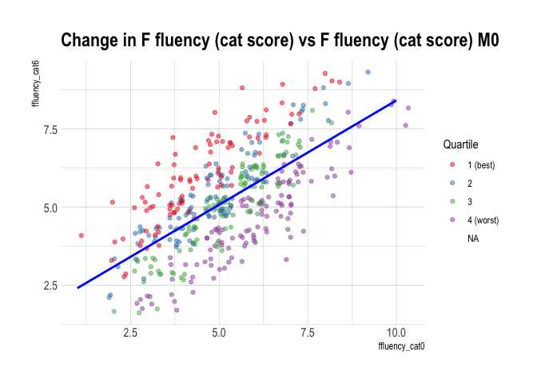

# Objective

To examine aspects of practice/learning effects in the subdomains of language as a risk factor for AD conversion.  

These analyses use particpants that entered ADNI with MCI.  The outcome is conversion to AD.

# Descriptive plots and tables of the language subdomains

## Animal naming (raw score)

<!--html_preserve-->

<table class="gt_table">
  <thead class="gt_header">
    <tr>
      <th colspan="2" class="gt_heading gt_title gt_font_normal gt_center" style>Summary table of change in Animal (raw score)</th>
    </tr>
    <tr>
      <th colspan="2" class="gt_heading gt_subtitle gt_font_normal gt_center gt_bottom_border" style></th>
    </tr>
  </thead>
  <thead class="gt_col_headings">
    <tr>
      <th class="gt_col_heading gt_columns_bottom_border gt_left" rowspan="1" colspan="1"></th>
      <th class="gt_col_heading gt_columns_bottom_border gt_center" rowspan="1" colspan="1">n</th>
    </tr>
  </thead>
  <tbody class="gt_table_body">
    <tr>
      <td class="gt_row gt_left gt_stub">-15</td>
      <td class="gt_row gt_center">1</td>
    </tr>
    <tr>
      <td class="gt_row gt_left gt_stub">-12</td>
      <td class="gt_row gt_center gt_striped">4</td>
    </tr>
    <tr>
      <td class="gt_row gt_left gt_stub">-11</td>
      <td class="gt_row gt_center">4</td>
    </tr>
    <tr>
      <td class="gt_row gt_left gt_stub">-10</td>
      <td class="gt_row gt_center gt_striped">5</td>
    </tr>
    <tr>
      <td class="gt_row gt_left gt_stub">-9</td>
      <td class="gt_row gt_center">8</td>
    </tr>
    <tr>
      <td class="gt_row gt_left gt_stub">-8</td>
      <td class="gt_row gt_center gt_striped">16</td>
    </tr>
    <tr>
      <td class="gt_row gt_left gt_stub">-7</td>
      <td class="gt_row gt_center">18</td>
    </tr>
    <tr>
      <td class="gt_row gt_left gt_stub">-6</td>
      <td class="gt_row gt_center gt_striped">23</td>
    </tr>
    <tr>
      <td class="gt_row gt_left gt_stub">-5</td>
      <td class="gt_row gt_center">47</td>
    </tr>
    <tr>
      <td class="gt_row gt_left gt_stub">-4</td>
      <td class="gt_row gt_center gt_striped">42</td>
    </tr>
    <tr>
      <td class="gt_row gt_left gt_stub">-3</td>
      <td class="gt_row gt_center">69</td>
    </tr>
    <tr>
      <td class="gt_row gt_left gt_stub">-2</td>
      <td class="gt_row gt_center gt_striped">77</td>
    </tr>
    <tr>
      <td class="gt_row gt_left gt_stub">-1</td>
      <td class="gt_row gt_center">83</td>
    </tr>
    <tr>
      <td class="gt_row gt_left gt_stub">0</td>
      <td class="gt_row gt_center gt_striped">83</td>
    </tr>
    <tr>
      <td class="gt_row gt_left gt_stub">1</td>
      <td class="gt_row gt_center">89</td>
    </tr>
    <tr>
      <td class="gt_row gt_left gt_stub">2</td>
      <td class="gt_row gt_center gt_striped">62</td>
    </tr>
    <tr>
      <td class="gt_row gt_left gt_stub">3</td>
      <td class="gt_row gt_center">56</td>
    </tr>
    <tr>
      <td class="gt_row gt_left gt_stub">4</td>
      <td class="gt_row gt_center gt_striped">42</td>
    </tr>
    <tr>
      <td class="gt_row gt_left gt_stub">5</td>
      <td class="gt_row gt_center">25</td>
    </tr>
    <tr>
      <td class="gt_row gt_left gt_stub">6</td>
      <td class="gt_row gt_center gt_striped">17</td>
    </tr>
    <tr>
      <td class="gt_row gt_left gt_stub">7</td>
      <td class="gt_row gt_center">16</td>
    </tr>
    <tr>
      <td class="gt_row gt_left gt_stub">8</td>
      <td class="gt_row gt_center gt_striped">11</td>
    </tr>
    <tr>
      <td class="gt_row gt_left gt_stub">9</td>
      <td class="gt_row gt_center">5</td>
    </tr>
    <tr>
      <td class="gt_row gt_left gt_stub">10</td>
      <td class="gt_row gt_center gt_striped">1</td>
    </tr>
    <tr>
      <td class="gt_row gt_left gt_stub">11</td>
      <td class="gt_row gt_center">4</td>
    </tr>
    <tr>
      <td class="gt_row gt_left gt_stub">15</td>
      <td class="gt_row gt_center gt_striped">1</td>
    </tr>
    <tr>
      <td class="gt_row gt_left gt_stub">NA</td>
      <td class="gt_row gt_center">1</td>
    </tr>
    <tr>
      <td class="gt_row gt_stub gt_right gt_grand_summary_row gt_first_grand_summary_row">Total</td>
      <td class="gt_row gt_center gt_grand_summary_row gt_first_grand_summary_row">810</td>
    </tr>
  </tbody>
  
  
</table>
<!--/html_preserve-->

## Animal naming (categorical score)

<!--html_preserve-->

<table class="gt_table">
  <thead class="gt_header">
    <tr>
      <th colspan="2" class="gt_heading gt_title gt_font_normal gt_center" style>Summary table of change in Animal (cat score)</th>
    </tr>
    <tr>
      <th colspan="2" class="gt_heading gt_subtitle gt_font_normal gt_center gt_bottom_border" style></th>
    </tr>
  </thead>
  <thead class="gt_col_headings">
    <tr>
      <th class="gt_col_heading gt_columns_bottom_border gt_left" rowspan="1" colspan="1"></th>
      <th class="gt_col_heading gt_columns_bottom_border gt_center" rowspan="1" colspan="1">n</th>
    </tr>
  </thead>
  <tbody class="gt_table_body">
    <tr>
      <td class="gt_row gt_left gt_stub">-5</td>
      <td class="gt_row gt_center">1</td>
    </tr>
    <tr>
      <td class="gt_row gt_left gt_stub">-4</td>
      <td class="gt_row gt_center gt_striped">4</td>
    </tr>
    <tr>
      <td class="gt_row gt_left gt_stub">-3</td>
      <td class="gt_row gt_center">31</td>
    </tr>
    <tr>
      <td class="gt_row gt_left gt_stub">-2</td>
      <td class="gt_row gt_center gt_striped">83</td>
    </tr>
    <tr>
      <td class="gt_row gt_left gt_stub">-1</td>
      <td class="gt_row gt_center">195</td>
    </tr>
    <tr>
      <td class="gt_row gt_left gt_stub">0</td>
      <td class="gt_row gt_center gt_striped">253</td>
    </tr>
    <tr>
      <td class="gt_row gt_left gt_stub">1</td>
      <td class="gt_row gt_center">158</td>
    </tr>
    <tr>
      <td class="gt_row gt_left gt_stub">2</td>
      <td class="gt_row gt_center gt_striped">65</td>
    </tr>
    <tr>
      <td class="gt_row gt_left gt_stub">3</td>
      <td class="gt_row gt_center">18</td>
    </tr>
    <tr>
      <td class="gt_row gt_left gt_stub">5</td>
      <td class="gt_row gt_center gt_striped">1</td>
    </tr>
    <tr>
      <td class="gt_row gt_left gt_stub">NA</td>
      <td class="gt_row gt_center">1</td>
    </tr>
    <tr>
      <td class="gt_row gt_stub gt_right gt_grand_summary_row gt_first_grand_summary_row">Total</td>
      <td class="gt_row gt_center gt_grand_summary_row gt_first_grand_summary_row">810</td>
    </tr>
  </tbody>
  
  
</table>
<!--/html_preserve-->

## F fluency (raw score)

<!--html_preserve-->

<table class="gt_table">
  <thead class="gt_header">
    <tr>
      <th colspan="2" class="gt_heading gt_title gt_font_normal gt_center" style>Summary table of change in F fluency (raw score)</th>
    </tr>
    <tr>
      <th colspan="2" class="gt_heading gt_subtitle gt_font_normal gt_center gt_bottom_border" style></th>
    </tr>
  </thead>
  <thead class="gt_col_headings">
    <tr>
      <th class="gt_col_heading gt_columns_bottom_border gt_left" rowspan="1" colspan="1"></th>
      <th class="gt_col_heading gt_columns_bottom_border gt_center" rowspan="1" colspan="1">n</th>
    </tr>
  </thead>
  <tbody class="gt_table_body">
    <tr>
      <td class="gt_row gt_left gt_stub">-11</td>
      <td class="gt_row gt_center">1</td>
    </tr>
    <tr>
      <td class="gt_row gt_left gt_stub">-10</td>
      <td class="gt_row gt_center gt_striped">2</td>
    </tr>
    <tr>
      <td class="gt_row gt_left gt_stub">-9</td>
      <td class="gt_row gt_center">1</td>
    </tr>
    <tr>
      <td class="gt_row gt_left gt_stub">-8</td>
      <td class="gt_row gt_center gt_striped">4</td>
    </tr>
    <tr>
      <td class="gt_row gt_left gt_stub">-7</td>
      <td class="gt_row gt_center">6</td>
    </tr>
    <tr>
      <td class="gt_row gt_left gt_stub">-6</td>
      <td class="gt_row gt_center gt_striped">12</td>
    </tr>
    <tr>
      <td class="gt_row gt_left gt_stub">-5</td>
      <td class="gt_row gt_center">17</td>
    </tr>
    <tr>
      <td class="gt_row gt_left gt_stub">-4</td>
      <td class="gt_row gt_center gt_striped">29</td>
    </tr>
    <tr>
      <td class="gt_row gt_left gt_stub">-3</td>
      <td class="gt_row gt_center">36</td>
    </tr>
    <tr>
      <td class="gt_row gt_left gt_stub">-2</td>
      <td class="gt_row gt_center gt_striped">32</td>
    </tr>
    <tr>
      <td class="gt_row gt_left gt_stub">-1</td>
      <td class="gt_row gt_center">40</td>
    </tr>
    <tr>
      <td class="gt_row gt_left gt_stub">0</td>
      <td class="gt_row gt_center gt_striped">60</td>
    </tr>
    <tr>
      <td class="gt_row gt_left gt_stub">1</td>
      <td class="gt_row gt_center">51</td>
    </tr>
    <tr>
      <td class="gt_row gt_left gt_stub">2</td>
      <td class="gt_row gt_center gt_striped">40</td>
    </tr>
    <tr>
      <td class="gt_row gt_left gt_stub">3</td>
      <td class="gt_row gt_center">36</td>
    </tr>
    <tr>
      <td class="gt_row gt_left gt_stub">4</td>
      <td class="gt_row gt_center gt_striped">26</td>
    </tr>
    <tr>
      <td class="gt_row gt_left gt_stub">5</td>
      <td class="gt_row gt_center">11</td>
    </tr>
    <tr>
      <td class="gt_row gt_left gt_stub">6</td>
      <td class="gt_row gt_center gt_striped">10</td>
    </tr>
    <tr>
      <td class="gt_row gt_left gt_stub">7</td>
      <td class="gt_row gt_center">7</td>
    </tr>
    <tr>
      <td class="gt_row gt_left gt_stub">8</td>
      <td class="gt_row gt_center gt_striped">3</td>
    </tr>
    <tr>
      <td class="gt_row gt_left gt_stub">9</td>
      <td class="gt_row gt_center">2</td>
    </tr>
    <tr>
      <td class="gt_row gt_left gt_stub">10</td>
      <td class="gt_row gt_center gt_striped">3</td>
    </tr>
    <tr>
      <td class="gt_row gt_left gt_stub">11</td>
      <td class="gt_row gt_center">1</td>
    </tr>
    <tr>
      <td class="gt_row gt_left gt_stub">NA</td>
      <td class="gt_row gt_center gt_striped">380</td>
    </tr>
    <tr>
      <td class="gt_row gt_stub gt_right gt_grand_summary_row gt_first_grand_summary_row">Total</td>
      <td class="gt_row gt_center gt_grand_summary_row gt_first_grand_summary_row">810</td>
    </tr>
  </tbody>
  
  
</table>
<!--/html_preserve-->

## F fluency (cat score)

<!--html_preserve-->

<table class="gt_table">
  <thead class="gt_header">
    <tr>
      <th colspan="2" class="gt_heading gt_title gt_font_normal gt_center" style>Summary table of change in F fluency (cat score)</th>
    </tr>
    <tr>
      <th colspan="2" class="gt_heading gt_subtitle gt_font_normal gt_center gt_bottom_border" style></th>
    </tr>
  </thead>
  <thead class="gt_col_headings">
    <tr>
      <th class="gt_col_heading gt_columns_bottom_border gt_left" rowspan="1" colspan="1"></th>
      <th class="gt_col_heading gt_columns_bottom_border gt_center" rowspan="1" colspan="1">n</th>
    </tr>
  </thead>
  <tbody class="gt_table_body">
    <tr>
      <td class="gt_row gt_left gt_stub">-4</td>
      <td class="gt_row gt_center">1</td>
    </tr>
    <tr>
      <td class="gt_row gt_left gt_stub">-3</td>
      <td class="gt_row gt_center gt_striped">6</td>
    </tr>
    <tr>
      <td class="gt_row gt_left gt_stub">-2</td>
      <td class="gt_row gt_center">46</td>
    </tr>
    <tr>
      <td class="gt_row gt_left gt_stub">-1</td>
      <td class="gt_row gt_center gt_striped">87</td>
    </tr>
    <tr>
      <td class="gt_row gt_left gt_stub">0</td>
      <td class="gt_row gt_center">143</td>
    </tr>
    <tr>
      <td class="gt_row gt_left gt_stub">1</td>
      <td class="gt_row gt_center gt_striped">102</td>
    </tr>
    <tr>
      <td class="gt_row gt_left gt_stub">2</td>
      <td class="gt_row gt_center">36</td>
    </tr>
    <tr>
      <td class="gt_row gt_left gt_stub">3</td>
      <td class="gt_row gt_center gt_striped">9</td>
    </tr>
    <tr>
      <td class="gt_row gt_left gt_stub">NA</td>
      <td class="gt_row gt_center">380</td>
    </tr>
    <tr>
      <td class="gt_row gt_stub gt_right gt_grand_summary_row gt_first_grand_summary_row">Total</td>
      <td class="gt_row gt_center gt_grand_summary_row gt_first_grand_summary_row">810</td>
    </tr>
  </tbody>
  
  
</table>
<!--/html_preserve-->

## Confrontational naming

<!--html_preserve-->

<table class="gt_table">
  <thead class="gt_header">
    <tr>
      <th colspan="2" class="gt_heading gt_title gt_font_normal gt_center" style>Summary table of Change in confrontational naming</th>
    </tr>
    <tr>
      <th colspan="2" class="gt_heading gt_subtitle gt_font_normal gt_center gt_bottom_border" style></th>
    </tr>
  </thead>
  <thead class="gt_col_headings">
    <tr>
      <th class="gt_col_heading gt_columns_bottom_border gt_left" rowspan="1" colspan="1"></th>
      <th class="gt_col_heading gt_columns_bottom_border gt_center" rowspan="1" colspan="1">n</th>
    </tr>
  </thead>
  <tbody class="gt_table_body">
    <tr>
      <td class="gt_row gt_left gt_stub">(-2.41,-2.26]</td>
      <td class="gt_row gt_center">3</td>
    </tr>
    <tr>
      <td class="gt_row gt_left gt_stub">(-1.96,-1.81]</td>
      <td class="gt_row gt_center gt_striped">1</td>
    </tr>
    <tr>
      <td class="gt_row gt_left gt_stub">(-1.66,-1.51]</td>
      <td class="gt_row gt_center">6</td>
    </tr>
    <tr>
      <td class="gt_row gt_left gt_stub">(-1.51,-1.37]</td>
      <td class="gt_row gt_center gt_striped">7</td>
    </tr>
    <tr>
      <td class="gt_row gt_left gt_stub">(-1.22,-1.07]</td>
      <td class="gt_row gt_center">18</td>
    </tr>
    <tr>
      <td class="gt_row gt_left gt_stub">(-1.07,-0.921]</td>
      <td class="gt_row gt_center gt_striped">27</td>
    </tr>
    <tr>
      <td class="gt_row gt_left gt_stub">(-0.921,-0.772]</td>
      <td class="gt_row gt_center">15</td>
    </tr>
    <tr>
      <td class="gt_row gt_left gt_stub">(-0.772,-0.624]</td>
      <td class="gt_row gt_center gt_striped">17</td>
    </tr>
    <tr>
      <td class="gt_row gt_left gt_stub">(-0.624,-0.475]</td>
      <td class="gt_row gt_center">28</td>
    </tr>
    <tr>
      <td class="gt_row gt_left gt_stub">(-0.475,-0.327]</td>
      <td class="gt_row gt_center gt_striped">47</td>
    </tr>
    <tr>
      <td class="gt_row gt_left gt_stub">(-0.327,-0.178]</td>
      <td class="gt_row gt_center">37</td>
    </tr>
    <tr>
      <td class="gt_row gt_left gt_stub">(-0.178,-0.03]</td>
      <td class="gt_row gt_center gt_striped">15</td>
    </tr>
    <tr>
      <td class="gt_row gt_left gt_stub">(-0.03,0.119]</td>
      <td class="gt_row gt_center">319</td>
    </tr>
    <tr>
      <td class="gt_row gt_left gt_stub">(0.119,0.267]</td>
      <td class="gt_row gt_center gt_striped">25</td>
    </tr>
    <tr>
      <td class="gt_row gt_left gt_stub">(0.267,0.416]</td>
      <td class="gt_row gt_center">42</td>
    </tr>
    <tr>
      <td class="gt_row gt_left gt_stub">(0.416,0.564]</td>
      <td class="gt_row gt_center gt_striped">50</td>
    </tr>
    <tr>
      <td class="gt_row gt_left gt_stub">(0.564,0.713]</td>
      <td class="gt_row gt_center">13</td>
    </tr>
    <tr>
      <td class="gt_row gt_left gt_stub">(0.713,0.861]</td>
      <td class="gt_row gt_center gt_striped">25</td>
    </tr>
    <tr>
      <td class="gt_row gt_left gt_stub">(0.861,1.01]</td>
      <td class="gt_row gt_center">54</td>
    </tr>
    <tr>
      <td class="gt_row gt_left gt_stub">(1.01,1.16]</td>
      <td class="gt_row gt_center gt_striped">29</td>
    </tr>
    <tr>
      <td class="gt_row gt_left gt_stub">(1.16,1.31]</td>
      <td class="gt_row gt_center">3</td>
    </tr>
    <tr>
      <td class="gt_row gt_left gt_stub">(1.31,1.46]</td>
      <td class="gt_row gt_center gt_striped">14</td>
    </tr>
    <tr>
      <td class="gt_row gt_left gt_stub">(1.46,1.6]</td>
      <td class="gt_row gt_center">2</td>
    </tr>
    <tr>
      <td class="gt_row gt_left gt_stub">(1.6,1.75]</td>
      <td class="gt_row gt_center gt_striped">3</td>
    </tr>
    <tr>
      <td class="gt_row gt_left gt_stub">(1.75,1.9]</td>
      <td class="gt_row gt_center">3</td>
    </tr>
    <tr>
      <td class="gt_row gt_left gt_stub">(1.9,2.05]</td>
      <td class="gt_row gt_center gt_striped">6</td>
    </tr>
    <tr>
      <td class="gt_row gt_left gt_stub">NA</td>
      <td class="gt_row gt_center">1</td>
    </tr>
    <tr>
      <td class="gt_row gt_stub gt_right gt_grand_summary_row gt_first_grand_summary_row">Total</td>
      <td class="gt_row gt_center gt_grand_summary_row gt_first_grand_summary_row">810</td>
    </tr>
  </tbody>
  
  
</table>
<!--/html_preserve-->

## Other language items

<!--html_preserve-->

<table class="gt_table">
  <thead class="gt_header">
    <tr>
      <th colspan="2" class="gt_heading gt_title gt_font_normal gt_center" style>Summary table of Change in other language items</th>
    </tr>
    <tr>
      <th colspan="2" class="gt_heading gt_subtitle gt_font_normal gt_center gt_bottom_border" style></th>
    </tr>
  </thead>
  <thead class="gt_col_headings">
    <tr>
      <th class="gt_col_heading gt_columns_bottom_border gt_left" rowspan="1" colspan="1"></th>
      <th class="gt_col_heading gt_columns_bottom_border gt_center" rowspan="1" colspan="1">n</th>
    </tr>
  </thead>
  <tbody class="gt_table_body">
    <tr>
      <td class="gt_row gt_left gt_stub">(-2.57,-2.39]</td>
      <td class="gt_row gt_center">4</td>
    </tr>
    <tr>
      <td class="gt_row gt_left gt_stub">(-2.22,-2.04]</td>
      <td class="gt_row gt_center gt_striped">4</td>
    </tr>
    <tr>
      <td class="gt_row gt_left gt_stub">(-2.04,-1.87]</td>
      <td class="gt_row gt_center">7</td>
    </tr>
    <tr>
      <td class="gt_row gt_left gt_stub">(-1.87,-1.7]</td>
      <td class="gt_row gt_center gt_striped">4</td>
    </tr>
    <tr>
      <td class="gt_row gt_left gt_stub">(-1.7,-1.53]</td>
      <td class="gt_row gt_center">3</td>
    </tr>
    <tr>
      <td class="gt_row gt_left gt_stub">(-1.53,-1.36]</td>
      <td class="gt_row gt_center gt_striped">26</td>
    </tr>
    <tr>
      <td class="gt_row gt_left gt_stub">(-1.36,-1.19]</td>
      <td class="gt_row gt_center">18</td>
    </tr>
    <tr>
      <td class="gt_row gt_left gt_stub">(-1.19,-1.01]</td>
      <td class="gt_row gt_center gt_striped">14</td>
    </tr>
    <tr>
      <td class="gt_row gt_left gt_stub">(-1.01,-0.842]</td>
      <td class="gt_row gt_center">14</td>
    </tr>
    <tr>
      <td class="gt_row gt_left gt_stub">(-0.842,-0.671]</td>
      <td class="gt_row gt_center gt_striped">74</td>
    </tr>
    <tr>
      <td class="gt_row gt_left gt_stub">(-0.671,-0.499]</td>
      <td class="gt_row gt_center">29</td>
    </tr>
    <tr>
      <td class="gt_row gt_left gt_stub">(-0.499,-0.327]</td>
      <td class="gt_row gt_center gt_striped">37</td>
    </tr>
    <tr>
      <td class="gt_row gt_left gt_stub">(-0.327,-0.155]</td>
      <td class="gt_row gt_center">10</td>
    </tr>
    <tr>
      <td class="gt_row gt_left gt_stub">(-0.155,0.0165]</td>
      <td class="gt_row gt_center gt_striped">334</td>
    </tr>
    <tr>
      <td class="gt_row gt_left gt_stub">(0.0165,0.188]</td>
      <td class="gt_row gt_center">15</td>
    </tr>
    <tr>
      <td class="gt_row gt_left gt_stub">(0.188,0.36]</td>
      <td class="gt_row gt_center gt_striped">26</td>
    </tr>
    <tr>
      <td class="gt_row gt_left gt_stub">(0.36,0.532]</td>
      <td class="gt_row gt_center">28</td>
    </tr>
    <tr>
      <td class="gt_row gt_left gt_stub">(0.532,0.704]</td>
      <td class="gt_row gt_center gt_striped">23</td>
    </tr>
    <tr>
      <td class="gt_row gt_left gt_stub">(0.704,0.875]</td>
      <td class="gt_row gt_center">62</td>
    </tr>
    <tr>
      <td class="gt_row gt_left gt_stub">(0.875,1.05]</td>
      <td class="gt_row gt_center gt_striped">13</td>
    </tr>
    <tr>
      <td class="gt_row gt_left gt_stub">(1.05,1.22]</td>
      <td class="gt_row gt_center">11</td>
    </tr>
    <tr>
      <td class="gt_row gt_left gt_stub">(1.22,1.39]</td>
      <td class="gt_row gt_center gt_striped">14</td>
    </tr>
    <tr>
      <td class="gt_row gt_left gt_stub">(1.39,1.56]</td>
      <td class="gt_row gt_center">17</td>
    </tr>
    <tr>
      <td class="gt_row gt_left gt_stub">(1.56,1.73]</td>
      <td class="gt_row gt_center gt_striped">4</td>
    </tr>
    <tr>
      <td class="gt_row gt_left gt_stub">(1.73,1.91]</td>
      <td class="gt_row gt_center">9</td>
    </tr>
    <tr>
      <td class="gt_row gt_left gt_stub">(1.91,2.08]</td>
      <td class="gt_row gt_center gt_striped">3</td>
    </tr>
    <tr>
      <td class="gt_row gt_left gt_stub">(2.08,2.25]</td>
      <td class="gt_row gt_center">2</td>
    </tr>
    <tr>
      <td class="gt_row gt_left gt_stub">(2.25,2.42]</td>
      <td class="gt_row gt_center gt_striped">3</td>
    </tr>
    <tr>
      <td class="gt_row gt_left gt_stub">(2.42,2.6]</td>
      <td class="gt_row gt_center">1</td>
    </tr>
    <tr>
      <td class="gt_row gt_left gt_stub">NA</td>
      <td class="gt_row gt_center gt_striped">1</td>
    </tr>
    <tr>
      <td class="gt_row gt_stub gt_right gt_grand_summary_row gt_first_grand_summary_row">Total</td>
      <td class="gt_row gt_center gt_grand_summary_row gt_first_grand_summary_row">810</td>
    </tr>
  </tbody>
  
  
</table>
<!--/html_preserve-->

# Time to event analyses

This section examines the time to conversion for participants with MCI to AD.

## From MCI at baseline to AD

### Kaplan Meier curves

Kaplan Meier curves stratified by the quantiled change in test scores.

#### Individual language subdomains

Kaplan Meier curves of the retest improvement in individual language subdomains.

<!-- --><!-- --><!-- --><!-- --><!-- --><!-- -->

### Cox proportional hazards models

The reference group in the models is the first (best) quantile.

<table class="table table-striped table-hover table-condensed table-responsive" style="width: auto !important; ">
<caption>Cox proportional hazards model (Baseline MCI) - Animal fluency (raw score) Quartiles</caption>
 <thead>
  <tr>
   <th style="text-align:left;text-align: center;"> Predictor </th>
   <th style="text-align:right;text-align: center;"> HR </th>
   <th style="text-align:right;text-align: center;"> P-value </th>
  </tr>
 </thead>
<tbody>
  <tr>
   <td style="text-align:left;width: 6em; "> anim_raw_q2 </td>
   <td style="text-align:right;width: 5em; "> 1.24 </td>
   <td style="text-align:right;width: 6em; "> 0.248 </td>
  </tr>
  <tr>
   <td style="text-align:left;width: 6em; "> anim_raw_q3 </td>
   <td style="text-align:right;width: 5em; "> 2.02 </td>
   <td style="text-align:right;width: 6em; "> 0.000 </td>
  </tr>
  <tr>
   <td style="text-align:left;width: 6em; "> anim_raw_q4 </td>
   <td style="text-align:right;width: 5em; "> 1.71 </td>
   <td style="text-align:right;width: 6em; "> 0.003 </td>
  </tr>
</tbody>
</table>

<table class="table table-striped table-hover table-condensed table-responsive" style="width: auto !important; ">
<caption>Cox proportional hazards model (Baseline MCI) - Animal fluency (categorical score) Quartiles</caption>
 <thead>
  <tr>
   <th style="text-align:left;text-align: center;"> Predictor </th>
   <th style="text-align:right;text-align: center;"> HR </th>
   <th style="text-align:right;text-align: center;"> P-value </th>
  </tr>
 </thead>
<tbody>
  <tr>
   <td style="text-align:left;width: 6em; "> anim_cat_q2 </td>
   <td style="text-align:right;width: 5em; "> 1.44 </td>
   <td style="text-align:right;width: 6em; "> 0.052 </td>
  </tr>
  <tr>
   <td style="text-align:left;width: 6em; "> anim_cat_q3 </td>
   <td style="text-align:right;width: 5em; "> 1.87 </td>
   <td style="text-align:right;width: 6em; "> 0.000 </td>
  </tr>
  <tr>
   <td style="text-align:left;width: 6em; "> anim_cat_q4 </td>
   <td style="text-align:right;width: 5em; "> 2.33 </td>
   <td style="text-align:right;width: 6em; "> 0.000 </td>
  </tr>
</tbody>
</table>

<table class="table table-striped table-hover table-condensed table-responsive" style="width: auto !important; ">
<caption>Cox proportional hazards model (Baseline MCI) - F fluency (raw score) Quartiles</caption>
 <thead>
  <tr>
   <th style="text-align:left;text-align: center;"> Predictor </th>
   <th style="text-align:right;text-align: center;"> HR </th>
   <th style="text-align:right;text-align: center;"> P-value </th>
  </tr>
 </thead>
<tbody>
  <tr>
   <td style="text-align:left;width: 6em; "> f_raw_q2 </td>
   <td style="text-align:right;width: 5em; "> 1.31 </td>
   <td style="text-align:right;width: 6em; "> 0.378 </td>
  </tr>
  <tr>
   <td style="text-align:left;width: 6em; "> f_raw_q3 </td>
   <td style="text-align:right;width: 5em; "> 1.17 </td>
   <td style="text-align:right;width: 6em; "> 0.616 </td>
  </tr>
  <tr>
   <td style="text-align:left;width: 6em; "> f_raw_q4 </td>
   <td style="text-align:right;width: 5em; "> 1.55 </td>
   <td style="text-align:right;width: 6em; "> 0.135 </td>
  </tr>
</tbody>
</table>

<table class="table table-striped table-hover table-condensed table-responsive" style="width: auto !important; ">
<caption>Cox proportional hazards model (Baseline MCI) - F fluency (categorical score) Quartiles</caption>
 <thead>
  <tr>
   <th style="text-align:left;text-align: center;"> Predictor </th>
   <th style="text-align:right;text-align: center;"> HR </th>
   <th style="text-align:right;text-align: center;"> P-value </th>
  </tr>
 </thead>
<tbody>
  <tr>
   <td style="text-align:left;width: 6em; "> f_cat_q2 </td>
   <td style="text-align:right;width: 5em; "> 0.81 </td>
   <td style="text-align:right;width: 6em; "> 0.496 </td>
  </tr>
  <tr>
   <td style="text-align:left;width: 6em; "> f_cat_q3 </td>
   <td style="text-align:right;width: 5em; "> 0.74 </td>
   <td style="text-align:right;width: 6em; "> 0.311 </td>
  </tr>
  <tr>
   <td style="text-align:left;width: 6em; "> f_cat_q4 </td>
   <td style="text-align:right;width: 5em; "> 1.11 </td>
   <td style="text-align:right;width: 6em; "> 0.711 </td>
  </tr>
</tbody>
</table>

<table class="table table-striped table-hover table-condensed table-responsive" style="width: auto !important; ">
<caption>Cox proportional hazards model (Baseline MCI) - Confrontational Quartiles</caption>
 <thead>
  <tr>
   <th style="text-align:left;text-align: center;"> Predictor </th>
   <th style="text-align:right;text-align: center;"> HR </th>
   <th style="text-align:right;text-align: center;"> P-value </th>
  </tr>
 </thead>
<tbody>
  <tr>
   <td style="text-align:left;width: 6em; "> confront_q2 </td>
   <td style="text-align:right;width: 5em; "> 1.02 </td>
   <td style="text-align:right;width: 6em; "> 0.904 </td>
  </tr>
  <tr>
   <td style="text-align:left;width: 6em; "> confront_q3 </td>
   <td style="text-align:right;width: 5em; "> 1.27 </td>
   <td style="text-align:right;width: 6em; "> 0.151 </td>
  </tr>
  <tr>
   <td style="text-align:left;width: 6em; "> confront_q4 </td>
   <td style="text-align:right;width: 5em; "> 1.84 </td>
   <td style="text-align:right;width: 6em; "> 0.000 </td>
  </tr>
</tbody>
</table>

<table class="table table-striped table-hover table-condensed table-responsive" style="width: auto !important; ">
<caption>Cox proportional hazards model (Baseline MCI) - Other language items Quartiles</caption>
 <thead>
  <tr>
   <th style="text-align:left;text-align: center;"> Predictor </th>
   <th style="text-align:right;text-align: center;"> HR </th>
   <th style="text-align:right;text-align: center;"> P-value </th>
  </tr>
 </thead>
<tbody>
  <tr>
   <td style="text-align:left;width: 6em; "> others_q2 </td>
   <td style="text-align:right;width: 5em; "> 0.68 </td>
   <td style="text-align:right;width: 6em; "> 0.029 </td>
  </tr>
  <tr>
   <td style="text-align:left;width: 6em; "> others_q3 </td>
   <td style="text-align:right;width: 5em; "> 1.05 </td>
   <td style="text-align:right;width: 6em; "> 0.771 </td>
  </tr>
  <tr>
   <td style="text-align:left;width: 6em; "> others_q4 </td>
   <td style="text-align:right;width: 5em; "> 1.27 </td>
   <td style="text-align:right;width: 6em; "> 0.133 </td>
  </tr>
</tbody>
</table>

# Time to event comparison between retest effects and biomarkers

This section compares how well the learning effects predict MCI/AD conversion to conventional biomarkers (imaging and genetic) predicting MCI/AD conversion.  The samples will be different for most of the analyses, because not all participants had all the biomarkers collected.  For biomarkers measured multiple times we will use those from the 6 month visit.

The biomarkers we will compare are:

* APOE 4 genotype - time invariant
* CSF AD signature from De Meyer (2010) - time invariant in dataset, unsure which visit was used
* Amyloid positivity - TBD
* Entorhinal cortical thickness (average between left and right) - 6M visit
* Hippocampus volume (separate 1.5T and 3T analyses) - 6M visit
* White matter hyperintensity - 6M visit
* Ventricular volume - TBD
* Subjective complaints - TBD

We will do separate analyses for baseline Normal to MCI/AD, and for baseline MCI to AD.

Models control for age, sex, and years of education.

## APOE 4

Any APOE 4 allele.

### MCI to AD

<!--html_preserve-->

<table class="gt_table">
  <thead class="gt_header">
    <tr>
      <th colspan="3" class="gt_heading gt_title gt_font_normal gt_center" style>Any APOE 4 allele by conversion status</th>
    </tr>
    <tr>
      <th colspan="3" class="gt_heading gt_subtitle gt_font_normal gt_center gt_bottom_border" style></th>
    </tr>
  </thead>
  <thead class="gt_col_headings">
    <tr>
      <th class="gt_col_heading gt_columns_bottom_border gt_left" rowspan="2" colspan="1">Conversion</th>
      <th class="gt_col_heading gt_center gt_columns_top_border gt_column_spanner" rowspan="1" colspan="2">Any APOE 4 allele</th>
    </tr>
    <tr>
      <th class="gt_col_heading gt_columns_bottom_border gt_center" rowspan="1" colspan="1">No</th>
      <th class="gt_col_heading gt_columns_bottom_border gt_center" rowspan="1" colspan="1">Yes</th>
    </tr>
  </thead>
  <tbody class="gt_table_body">
    <tr>
      <td class="gt_row gt_left gt_stub">0</td>
      <td class="gt_row gt_center">275</td>
      <td class="gt_row gt_center">202</td>
    </tr>
    <tr>
      <td class="gt_row gt_left gt_stub gt_striped">1</td>
      <td class="gt_row gt_center gt_striped">104</td>
      <td class="gt_row gt_center gt_striped">183</td>
    </tr>
  </tbody>
  
  
</table>
<!--/html_preserve-->

<!--html_preserve-->

<table class="gt_table" style="table-layout: fixed; width: 2070px">
  <colgroup>
    <col style="width: 80px"/>
    <col style="width: 150px"/>
    <col style="width: 80px"/>
    <col style="width: 150px"/>
    <col style="width: 80px"/>
    <col style="width: 150px"/>
    <col style="width: 80px"/>
    <col style="width: 150px"/>
    <col style="width: 80px"/>
    <col style="width: 150px"/>
    <col style="width: 80px"/>
    <col style="width: 150px"/>
    <col style="width: 80px"/>
    <col style="width: 150px"/>
    <col style="width: 80px"/>
    <col style="width: 150px"/>
    <col style="width: 80px"/>
    <col style="width: 150px"/>
  </colgroup>
  <thead class="gt_header">
    <tr>
      <th colspan="19" class="gt_heading gt_title gt_font_normal gt_center" style>Cox proportional hazards model (Baseline MCI)</th>
    </tr>
    <tr>
      <th colspan="19" class="gt_heading gt_subtitle gt_font_normal gt_center gt_bottom_border" style></th>
    </tr>
  </thead>
  <thead class="gt_col_headings">
    <tr>
      <th class="gt_col_heading gt_columns_bottom_border gt_left" rowspan="2" colspan="1">Covariate</th>
      <th class="gt_col_heading gt_center gt_columns_top_border gt_column_spanner gt_sep_right" rowspan="1" colspan="2">apoe4</th>
      <th class="gt_col_heading gt_center gt_columns_top_border gt_column_spanner gt_sep_right" rowspan="1" colspan="2">Animals (categories)</th>
      <th class="gt_col_heading gt_center gt_columns_top_border gt_column_spanner gt_sep_right" rowspan="1" colspan="2">Animal (categories) + apoe4</th>
      <th class="gt_col_heading gt_center gt_columns_top_border gt_column_spanner gt_sep_right" rowspan="1" colspan="2">Animals (raw scores)</th>
      <th class="gt_col_heading gt_center gt_columns_top_border gt_column_spanner gt_sep_right" rowspan="1" colspan="2">Animals (raw scores) + apoe4</th>
      <th class="gt_col_heading gt_center gt_columns_top_border gt_column_spanner gt_sep_right" rowspan="1" colspan="2">Confrontational naming</th>
      <th class="gt_col_heading gt_center gt_columns_top_border gt_column_spanner gt_sep_right" rowspan="1" colspan="2">Confrontational naming + apoe4</th>
      <th class="gt_col_heading gt_center gt_columns_top_border gt_column_spanner gt_sep_right" rowspan="1" colspan="2">Other Lang items</th>
      <th class="gt_col_heading gt_center gt_columns_top_border gt_column_spanner" rowspan="1" colspan="2">Other Lang items + apoe4</th>
    </tr>
    <tr>
      <th class="gt_col_heading gt_columns_bottom_border gt_center" rowspan="1" colspan="1">HR (95% CI)</th>
      <th class="gt_col_heading gt_columns_bottom_border gt_center" rowspan="1" colspan="1">p-value</th>
      <th class="gt_col_heading gt_columns_bottom_border gt_center" rowspan="1" colspan="1">HR (95% CI)</th>
      <th class="gt_col_heading gt_columns_bottom_border gt_center" rowspan="1" colspan="1">p-value</th>
      <th class="gt_col_heading gt_columns_bottom_border gt_center" rowspan="1" colspan="1">HR (95% CI)</th>
      <th class="gt_col_heading gt_columns_bottom_border gt_center" rowspan="1" colspan="1">p-value</th>
      <th class="gt_col_heading gt_columns_bottom_border gt_center" rowspan="1" colspan="1">HR (95% CI)</th>
      <th class="gt_col_heading gt_columns_bottom_border gt_center" rowspan="1" colspan="1">p-value</th>
      <th class="gt_col_heading gt_columns_bottom_border gt_center" rowspan="1" colspan="1">HR (95% CI)</th>
      <th class="gt_col_heading gt_columns_bottom_border gt_center" rowspan="1" colspan="1">p-value</th>
      <th class="gt_col_heading gt_columns_bottom_border gt_center" rowspan="1" colspan="1">HR (95% CI)</th>
      <th class="gt_col_heading gt_columns_bottom_border gt_center" rowspan="1" colspan="1">p-value</th>
      <th class="gt_col_heading gt_columns_bottom_border gt_center" rowspan="1" colspan="1">HR (95% CI)</th>
      <th class="gt_col_heading gt_columns_bottom_border gt_center" rowspan="1" colspan="1">p-value</th>
      <th class="gt_col_heading gt_columns_bottom_border gt_center" rowspan="1" colspan="1">HR (95% CI)</th>
      <th class="gt_col_heading gt_columns_bottom_border gt_center" rowspan="1" colspan="1">p-value</th>
      <th class="gt_col_heading gt_columns_bottom_border gt_center" rowspan="1" colspan="1">HR (95% CI)</th>
      <th class="gt_col_heading gt_columns_bottom_border gt_center" rowspan="1" colspan="1">p-value</th>
    </tr>
  </thead>
  <tbody class="gt_table_body">
    <tr class="gt_group_heading_row">
      <td colspan="19" class="gt_group_heading">Biomarker</td>
    </tr>
    <tr>
      <td class="gt_row gt_left gt_stub">apoe4</td>
      <td class="gt_row gt_center" style="background-color: #FFFFCC;">2.56,
(2.00,
 3.28)</td>
      <td class="gt_row gt_left" style="background-color: #FFFFCC;">0.000</td>
      <td class="gt_row gt_center"></td>
      <td class="gt_row gt_left"></td>
      <td class="gt_row gt_center" style="background-color: #FFFFCC;">2.57,
(2.01,
 3.29)</td>
      <td class="gt_row gt_left" style="background-color: #FFFFCC;">0.000</td>
      <td class="gt_row gt_center"></td>
      <td class="gt_row gt_left"></td>
      <td class="gt_row gt_center" style="background-color: #FFFFCC;">2.51,
(1.96,
 3.22)</td>
      <td class="gt_row gt_left" style="background-color: #FFFFCC;">0.000</td>
      <td class="gt_row gt_center"></td>
      <td class="gt_row gt_left"></td>
      <td class="gt_row gt_center" style="background-color: #FFFFCC;">2.51,
(1.96,
 3.21)</td>
      <td class="gt_row gt_left" style="background-color: #FFFFCC;">0.000</td>
      <td class="gt_row gt_center"></td>
      <td class="gt_row gt_left"></td>
      <td class="gt_row gt_center" style="background-color: #FFFFCC;">2.55,
(1.99,
 3.26)</td>
      <td class="gt_row gt_left" style="background-color: #FFFFCC;">0.000</td>
    </tr>
    <tr class="gt_group_heading_row">
      <td colspan="19" class="gt_group_heading">Animals (categorical)</td>
    </tr>
    <tr>
      <td class="gt_row gt_left gt_stub gt_striped">anim_cat_q2</td>
      <td class="gt_row gt_center gt_striped"></td>
      <td class="gt_row gt_left gt_striped"></td>
      <td class="gt_row gt_center gt_striped" style="background-color: #FFFFCC;">1.52,
(1.05,
 2.20)</td>
      <td class="gt_row gt_left gt_striped" style="background-color: #FFFFCC;">0.027</td>
      <td class="gt_row gt_center gt_striped">1.42,
(0.98,
 2.05)</td>
      <td class="gt_row gt_left gt_striped">0.066</td>
      <td class="gt_row gt_center gt_striped"></td>
      <td class="gt_row gt_left gt_striped"></td>
      <td class="gt_row gt_center gt_striped"></td>
      <td class="gt_row gt_left gt_striped"></td>
      <td class="gt_row gt_center gt_striped"></td>
      <td class="gt_row gt_left gt_striped"></td>
      <td class="gt_row gt_center gt_striped"></td>
      <td class="gt_row gt_left gt_striped"></td>
      <td class="gt_row gt_center gt_striped"></td>
      <td class="gt_row gt_left gt_striped"></td>
      <td class="gt_row gt_center gt_striped"></td>
      <td class="gt_row gt_left gt_striped"></td>
    </tr>
    <tr>
      <td class="gt_row gt_left gt_stub">anim_cat_q3</td>
      <td class="gt_row gt_center"></td>
      <td class="gt_row gt_left"></td>
      <td class="gt_row gt_center" style="background-color: #FFFFCC;">1.89,
(1.35,
 2.66)</td>
      <td class="gt_row gt_left" style="background-color: #FFFFCC;">0.000</td>
      <td class="gt_row gt_center" style="background-color: #FFFFCC;">1.79,
(1.27,
 2.51)</td>
      <td class="gt_row gt_left" style="background-color: #FFFFCC;">0.001</td>
      <td class="gt_row gt_center"></td>
      <td class="gt_row gt_left"></td>
      <td class="gt_row gt_center"></td>
      <td class="gt_row gt_left"></td>
      <td class="gt_row gt_center"></td>
      <td class="gt_row gt_left"></td>
      <td class="gt_row gt_center"></td>
      <td class="gt_row gt_left"></td>
      <td class="gt_row gt_center"></td>
      <td class="gt_row gt_left"></td>
      <td class="gt_row gt_center"></td>
      <td class="gt_row gt_left"></td>
    </tr>
    <tr>
      <td class="gt_row gt_left gt_stub gt_striped">anim_cat_q4</td>
      <td class="gt_row gt_center gt_striped"></td>
      <td class="gt_row gt_left gt_striped"></td>
      <td class="gt_row gt_center gt_striped" style="background-color: #FFFFCC;">2.26,
(1.61,
 3.18)</td>
      <td class="gt_row gt_left gt_striped" style="background-color: #FFFFCC;">0.000</td>
      <td class="gt_row gt_center gt_striped" style="background-color: #FFFFCC;">2.29,
(1.63,
 3.23)</td>
      <td class="gt_row gt_left gt_striped" style="background-color: #FFFFCC;">0.000</td>
      <td class="gt_row gt_center gt_striped"></td>
      <td class="gt_row gt_left gt_striped"></td>
      <td class="gt_row gt_center gt_striped"></td>
      <td class="gt_row gt_left gt_striped"></td>
      <td class="gt_row gt_center gt_striped"></td>
      <td class="gt_row gt_left gt_striped"></td>
      <td class="gt_row gt_center gt_striped"></td>
      <td class="gt_row gt_left gt_striped"></td>
      <td class="gt_row gt_center gt_striped"></td>
      <td class="gt_row gt_left gt_striped"></td>
      <td class="gt_row gt_center gt_striped"></td>
      <td class="gt_row gt_left gt_striped"></td>
    </tr>
    <tr class="gt_group_heading_row">
      <td colspan="19" class="gt_group_heading">Animals (raw score)</td>
    </tr>
    <tr>
      <td class="gt_row gt_left gt_stub">anim_raw_q2</td>
      <td class="gt_row gt_center"></td>
      <td class="gt_row gt_left"></td>
      <td class="gt_row gt_center"></td>
      <td class="gt_row gt_left"></td>
      <td class="gt_row gt_center"></td>
      <td class="gt_row gt_left"></td>
      <td class="gt_row gt_center">1.19,
(0.82,
 1.71)</td>
      <td class="gt_row gt_left">0.359</td>
      <td class="gt_row gt_center">1.24,
(0.86,
 1.78)</td>
      <td class="gt_row gt_left">0.253</td>
      <td class="gt_row gt_center"></td>
      <td class="gt_row gt_left"></td>
      <td class="gt_row gt_center"></td>
      <td class="gt_row gt_left"></td>
      <td class="gt_row gt_center"></td>
      <td class="gt_row gt_left"></td>
      <td class="gt_row gt_center"></td>
      <td class="gt_row gt_left"></td>
    </tr>
    <tr>
      <td class="gt_row gt_left gt_stub gt_striped">anim_raw_q3</td>
      <td class="gt_row gt_center gt_striped"></td>
      <td class="gt_row gt_left gt_striped"></td>
      <td class="gt_row gt_center gt_striped"></td>
      <td class="gt_row gt_left gt_striped"></td>
      <td class="gt_row gt_center gt_striped"></td>
      <td class="gt_row gt_left gt_striped"></td>
      <td class="gt_row gt_center gt_striped" style="background-color: #FFFFCC;">1.99,
(1.41,
 2.82)</td>
      <td class="gt_row gt_left gt_striped" style="background-color: #FFFFCC;">0.000</td>
      <td class="gt_row gt_center gt_striped" style="background-color: #FFFFCC;">1.87,
(1.32,
 2.65)</td>
      <td class="gt_row gt_left gt_striped" style="background-color: #FFFFCC;">0.000</td>
      <td class="gt_row gt_center gt_striped"></td>
      <td class="gt_row gt_left gt_striped"></td>
      <td class="gt_row gt_center gt_striped"></td>
      <td class="gt_row gt_left gt_striped"></td>
      <td class="gt_row gt_center gt_striped"></td>
      <td class="gt_row gt_left gt_striped"></td>
      <td class="gt_row gt_center gt_striped"></td>
      <td class="gt_row gt_left gt_striped"></td>
    </tr>
    <tr>
      <td class="gt_row gt_left gt_stub">anim_raw_q4</td>
      <td class="gt_row gt_center"></td>
      <td class="gt_row gt_left"></td>
      <td class="gt_row gt_center"></td>
      <td class="gt_row gt_left"></td>
      <td class="gt_row gt_center"></td>
      <td class="gt_row gt_left"></td>
      <td class="gt_row gt_center" style="background-color: #FFFFCC;">1.65,
(1.16,
 2.34)</td>
      <td class="gt_row gt_left" style="background-color: #FFFFCC;">0.005</td>
      <td class="gt_row gt_center" style="background-color: #FFFFCC;">1.71,
(1.21,
 2.44)</td>
      <td class="gt_row gt_left" style="background-color: #FFFFCC;">0.003</td>
      <td class="gt_row gt_center"></td>
      <td class="gt_row gt_left"></td>
      <td class="gt_row gt_center"></td>
      <td class="gt_row gt_left"></td>
      <td class="gt_row gt_center"></td>
      <td class="gt_row gt_left"></td>
      <td class="gt_row gt_center"></td>
      <td class="gt_row gt_left"></td>
    </tr>
    <tr class="gt_group_heading_row">
      <td colspan="19" class="gt_group_heading">Confrontational</td>
    </tr>
    <tr>
      <td class="gt_row gt_left gt_stub gt_striped">confront_q2</td>
      <td class="gt_row gt_center gt_striped"></td>
      <td class="gt_row gt_left gt_striped"></td>
      <td class="gt_row gt_center gt_striped"></td>
      <td class="gt_row gt_left gt_striped"></td>
      <td class="gt_row gt_center gt_striped"></td>
      <td class="gt_row gt_left gt_striped"></td>
      <td class="gt_row gt_center gt_striped"></td>
      <td class="gt_row gt_left gt_striped"></td>
      <td class="gt_row gt_center gt_striped"></td>
      <td class="gt_row gt_left gt_striped"></td>
      <td class="gt_row gt_center gt_striped">1.06,
(0.73,
 1.53)</td>
      <td class="gt_row gt_left gt_striped">0.751</td>
      <td class="gt_row gt_center gt_striped">1.12,
(0.77,
 1.62)</td>
      <td class="gt_row gt_left gt_striped">0.551</td>
      <td class="gt_row gt_center gt_striped"></td>
      <td class="gt_row gt_left gt_striped"></td>
      <td class="gt_row gt_center gt_striped"></td>
      <td class="gt_row gt_left gt_striped"></td>
    </tr>
    <tr>
      <td class="gt_row gt_left gt_stub">confront_q3</td>
      <td class="gt_row gt_center"></td>
      <td class="gt_row gt_left"></td>
      <td class="gt_row gt_center"></td>
      <td class="gt_row gt_left"></td>
      <td class="gt_row gt_center"></td>
      <td class="gt_row gt_left"></td>
      <td class="gt_row gt_center"></td>
      <td class="gt_row gt_left"></td>
      <td class="gt_row gt_center"></td>
      <td class="gt_row gt_left"></td>
      <td class="gt_row gt_center">1.29,
(0.93,
 1.79)</td>
      <td class="gt_row gt_left">0.129</td>
      <td class="gt_row gt_center">1.31,
(0.94,
 1.82)</td>
      <td class="gt_row gt_left">0.107</td>
      <td class="gt_row gt_center"></td>
      <td class="gt_row gt_left"></td>
      <td class="gt_row gt_center"></td>
      <td class="gt_row gt_left"></td>
    </tr>
    <tr>
      <td class="gt_row gt_left gt_stub gt_striped">confront_q4</td>
      <td class="gt_row gt_center gt_striped"></td>
      <td class="gt_row gt_left gt_striped"></td>
      <td class="gt_row gt_center gt_striped"></td>
      <td class="gt_row gt_left gt_striped"></td>
      <td class="gt_row gt_center gt_striped"></td>
      <td class="gt_row gt_left gt_striped"></td>
      <td class="gt_row gt_center gt_striped"></td>
      <td class="gt_row gt_left gt_striped"></td>
      <td class="gt_row gt_center gt_striped"></td>
      <td class="gt_row gt_left gt_striped"></td>
      <td class="gt_row gt_center gt_striped" style="background-color: #FFFFCC;">1.76,
(1.28,
 2.42)</td>
      <td class="gt_row gt_left gt_striped" style="background-color: #FFFFCC;">0.000</td>
      <td class="gt_row gt_center gt_striped" style="background-color: #FFFFCC;">1.69,
(1.23,
 2.33)</td>
      <td class="gt_row gt_left gt_striped" style="background-color: #FFFFCC;">0.001</td>
      <td class="gt_row gt_center gt_striped"></td>
      <td class="gt_row gt_left gt_striped"></td>
      <td class="gt_row gt_center gt_striped"></td>
      <td class="gt_row gt_left gt_striped"></td>
    </tr>
    <tr class="gt_group_heading_row">
      <td colspan="19" class="gt_group_heading">Other Lang items</td>
    </tr>
    <tr>
      <td class="gt_row gt_left gt_stub">others_q2</td>
      <td class="gt_row gt_center"></td>
      <td class="gt_row gt_left"></td>
      <td class="gt_row gt_center"></td>
      <td class="gt_row gt_left"></td>
      <td class="gt_row gt_center"></td>
      <td class="gt_row gt_left"></td>
      <td class="gt_row gt_center"></td>
      <td class="gt_row gt_left"></td>
      <td class="gt_row gt_center"></td>
      <td class="gt_row gt_left"></td>
      <td class="gt_row gt_center"></td>
      <td class="gt_row gt_left"></td>
      <td class="gt_row gt_center"></td>
      <td class="gt_row gt_left"></td>
      <td class="gt_row gt_center">0.71,
(0.50,
 1.01)</td>
      <td class="gt_row gt_left">0.057</td>
      <td class="gt_row gt_center">0.75,
(0.53,
 1.07)</td>
      <td class="gt_row gt_left">0.111</td>
    </tr>
    <tr>
      <td class="gt_row gt_left gt_stub gt_striped">others_q3</td>
      <td class="gt_row gt_center gt_striped"></td>
      <td class="gt_row gt_left gt_striped"></td>
      <td class="gt_row gt_center gt_striped"></td>
      <td class="gt_row gt_left gt_striped"></td>
      <td class="gt_row gt_center gt_striped"></td>
      <td class="gt_row gt_left gt_striped"></td>
      <td class="gt_row gt_center gt_striped"></td>
      <td class="gt_row gt_left gt_striped"></td>
      <td class="gt_row gt_center gt_striped"></td>
      <td class="gt_row gt_left gt_striped"></td>
      <td class="gt_row gt_center gt_striped"></td>
      <td class="gt_row gt_left gt_striped"></td>
      <td class="gt_row gt_center gt_striped"></td>
      <td class="gt_row gt_left gt_striped"></td>
      <td class="gt_row gt_center gt_striped">1.00,
(0.73,
 1.38)</td>
      <td class="gt_row gt_left gt_striped">0.991</td>
      <td class="gt_row gt_center gt_striped">1.04,
(0.75,
 1.42)</td>
      <td class="gt_row gt_left gt_striped">0.832</td>
    </tr>
    <tr>
      <td class="gt_row gt_left gt_stub">others_q4</td>
      <td class="gt_row gt_center"></td>
      <td class="gt_row gt_left"></td>
      <td class="gt_row gt_center"></td>
      <td class="gt_row gt_left"></td>
      <td class="gt_row gt_center"></td>
      <td class="gt_row gt_left"></td>
      <td class="gt_row gt_center"></td>
      <td class="gt_row gt_left"></td>
      <td class="gt_row gt_center"></td>
      <td class="gt_row gt_left"></td>
      <td class="gt_row gt_center"></td>
      <td class="gt_row gt_left"></td>
      <td class="gt_row gt_center"></td>
      <td class="gt_row gt_left"></td>
      <td class="gt_row gt_center">1.24,
(0.90,
 1.69)</td>
      <td class="gt_row gt_left">0.185</td>
      <td class="gt_row gt_center">1.27,
(0.93,
 1.74)</td>
      <td class="gt_row gt_left">0.131</td>
    </tr>
    <tr class="gt_group_heading_row">
      <td colspan="19" class="gt_group_heading">Covariates</td>
    </tr>
    <tr>
      <td class="gt_row gt_left gt_stub gt_striped">agebl</td>
      <td class="gt_row gt_center gt_striped" style="background-color: #FFFFCC;">1.04,
(1.03,
 1.06)</td>
      <td class="gt_row gt_left gt_striped" style="background-color: #FFFFCC;">0.000</td>
      <td class="gt_row gt_center gt_striped" style="background-color: #FFFFCC;">1.03,
(1.01,
 1.05)</td>
      <td class="gt_row gt_left gt_striped" style="background-color: #FFFFCC;">0.000</td>
      <td class="gt_row gt_center gt_striped" style="background-color: #FFFFCC;">1.04,
(1.02,
 1.06)</td>
      <td class="gt_row gt_left gt_striped" style="background-color: #FFFFCC;">0.000</td>
      <td class="gt_row gt_center gt_striped" style="background-color: #FFFFCC;">1.03,
(1.02,
 1.05)</td>
      <td class="gt_row gt_left gt_striped" style="background-color: #FFFFCC;">0.000</td>
      <td class="gt_row gt_center gt_striped" style="background-color: #FFFFCC;">1.04,
(1.02,
 1.06)</td>
      <td class="gt_row gt_left gt_striped" style="background-color: #FFFFCC;">0.000</td>
      <td class="gt_row gt_center gt_striped" style="background-color: #FFFFCC;">1.03,
(1.01,
 1.05)</td>
      <td class="gt_row gt_left gt_striped" style="background-color: #FFFFCC;">0.001</td>
      <td class="gt_row gt_center gt_striped" style="background-color: #FFFFCC;">1.04,
(1.02,
 1.06)</td>
      <td class="gt_row gt_left gt_striped" style="background-color: #FFFFCC;">0.000</td>
      <td class="gt_row gt_center gt_striped" style="background-color: #FFFFCC;">1.03,
(1.01,
 1.05)</td>
      <td class="gt_row gt_left gt_striped" style="background-color: #FFFFCC;">0.001</td>
      <td class="gt_row gt_center gt_striped" style="background-color: #FFFFCC;">1.04,
(1.02,
 1.06)</td>
      <td class="gt_row gt_left gt_striped" style="background-color: #FFFFCC;">0.000</td>
    </tr>
    <tr>
      <td class="gt_row gt_left gt_stub">ptsex</td>
      <td class="gt_row gt_center">1.16,
(0.91,
 1.48)</td>
      <td class="gt_row gt_left">0.241</td>
      <td class="gt_row gt_center">1.09,
(0.85,
 1.39)</td>
      <td class="gt_row gt_left">0.491</td>
      <td class="gt_row gt_center">1.16,
(0.91,
 1.49)</td>
      <td class="gt_row gt_left">0.228</td>
      <td class="gt_row gt_center">1.05,
(0.82,
 1.33)</td>
      <td class="gt_row gt_left">0.715</td>
      <td class="gt_row gt_center">1.13,
(0.89,
 1.45)</td>
      <td class="gt_row gt_left">0.316</td>
      <td class="gt_row gt_center">1.06,
(0.83,
 1.35)</td>
      <td class="gt_row gt_left">0.663</td>
      <td class="gt_row gt_center">1.13,
(0.88,
 1.45)</td>
      <td class="gt_row gt_left">0.321</td>
      <td class="gt_row gt_center">1.06,
(0.83,
 1.35)</td>
      <td class="gt_row gt_left">0.623</td>
      <td class="gt_row gt_center">1.15,
(0.90,
 1.47)</td>
      <td class="gt_row gt_left">0.256</td>
    </tr>
    <tr>
      <td class="gt_row gt_left gt_stub gt_striped">pteducat</td>
      <td class="gt_row gt_center gt_striped">1.00,
(0.96,
 1.05)</td>
      <td class="gt_row gt_left gt_striped">0.827</td>
      <td class="gt_row gt_center gt_striped">1.00,
(0.96,
 1.05)</td>
      <td class="gt_row gt_left gt_striped">0.840</td>
      <td class="gt_row gt_center gt_striped">1.01,
(0.97,
 1.05)</td>
      <td class="gt_row gt_left gt_striped">0.623</td>
      <td class="gt_row gt_center gt_striped">1.00,
(0.96,
 1.04)</td>
      <td class="gt_row gt_left gt_striped">0.964</td>
      <td class="gt_row gt_center gt_striped">1.01,
(0.97,
 1.05)</td>
      <td class="gt_row gt_left gt_striped">0.709</td>
      <td class="gt_row gt_center gt_striped">0.99,
(0.95,
 1.04)</td>
      <td class="gt_row gt_left gt_striped">0.767</td>
      <td class="gt_row gt_center gt_striped">1.00,
(0.96,
 1.04)</td>
      <td class="gt_row gt_left gt_striped">0.931</td>
      <td class="gt_row gt_center gt_striped">1.00,
(0.96,
 1.04)</td>
      <td class="gt_row gt_left gt_striped">0.941</td>
      <td class="gt_row gt_center gt_striped">1.01,
(0.96,
 1.05)</td>
      <td class="gt_row gt_left gt_striped">0.779</td>
    </tr>
  </tbody>
  <tfoot class="gt_sourcenotes">
    <tr>
      <td class="gt_sourcenote" colspan="19">Reference category for the retest domains is the first quartile (best retest)</td>
    </tr>
  </tfoot>
  
</table>
<!--/html_preserve--><!--html_preserve-->

<table class="gt_table">
  <thead class="gt_header">
    <tr>
      <th colspan="3" class="gt_heading gt_title gt_font_normal gt_center" style>Summary statistics for Cox models</th>
    </tr>
    <tr>
      <th colspan="3" class="gt_heading gt_subtitle gt_font_normal gt_center gt_bottom_border" style></th>
    </tr>
  </thead>
  <thead class="gt_col_headings">
    <tr>
      <th class="gt_col_heading gt_columns_bottom_border gt_left" rowspan="1" colspan="1">Model</th>
      <th class="gt_col_heading gt_columns_bottom_border gt_center" rowspan="1" colspan="1">n</th>
      <th class="gt_col_heading gt_columns_bottom_border gt_right" rowspan="1" colspan="1">concordance</th>
    </tr>
  </thead>
  <tbody class="gt_table_body">
    <tr class="gt_group_heading_row">
      <td colspan="3" class="gt_group_heading">Biomarker</td>
    </tr>
    <tr>
      <td class="gt_row gt_left gt_stub">apoe4</td>
      <td class="gt_row gt_center">764</td>
      <td class="gt_row gt_right">0.65</td>
    </tr>
    <tr class="gt_group_heading_row">
      <td colspan="3" class="gt_group_heading">Animal fluency (raw score)</td>
    </tr>
    <tr>
      <td class="gt_row gt_left gt_stub gt_striped">Animal (raw score)</td>
      <td class="gt_row gt_center gt_striped">764</td>
      <td class="gt_row gt_right gt_striped">0.59</td>
    </tr>
    <tr>
      <td class="gt_row gt_left gt_stub">Animal (raw score) + apoe4</td>
      <td class="gt_row gt_center">764</td>
      <td class="gt_row gt_right">0.66</td>
    </tr>
    <tr class="gt_group_heading_row">
      <td colspan="3" class="gt_group_heading">Animal fluency (categorial)</td>
    </tr>
    <tr>
      <td class="gt_row gt_left gt_stub gt_striped">Animal (categorical)</td>
      <td class="gt_row gt_center gt_striped">764</td>
      <td class="gt_row gt_right gt_striped">0.61</td>
    </tr>
    <tr>
      <td class="gt_row gt_left gt_stub">Animal (categorical) + apoe4</td>
      <td class="gt_row gt_center">764</td>
      <td class="gt_row gt_right">0.67</td>
    </tr>
    <tr class="gt_group_heading_row">
      <td colspan="3" class="gt_group_heading">Confrontational</td>
    </tr>
    <tr>
      <td class="gt_row gt_left gt_stub gt_striped">Confrontational</td>
      <td class="gt_row gt_center gt_striped">764</td>
      <td class="gt_row gt_right gt_striped">0.59</td>
    </tr>
    <tr>
      <td class="gt_row gt_left gt_stub">Confrontational + apoe4</td>
      <td class="gt_row gt_center">764</td>
      <td class="gt_row gt_right">0.66</td>
    </tr>
    <tr class="gt_group_heading_row">
      <td colspan="3" class="gt_group_heading">Other Language items</td>
    </tr>
    <tr>
      <td class="gt_row gt_left gt_stub gt_striped">Other language items</td>
      <td class="gt_row gt_center gt_striped">764</td>
      <td class="gt_row gt_right gt_striped">0.58</td>
    </tr>
    <tr>
      <td class="gt_row gt_left gt_stub">Other language items + apoe4</td>
      <td class="gt_row gt_center">764</td>
      <td class="gt_row gt_right">0.65</td>
    </tr>
  </tbody>
  
  
</table>
<!--/html_preserve-->

## CSF AD signature

CSF AD signature from De Meyer (2010)

### MCI to AD

<!--html_preserve-->

<table class="gt_table">
  <thead class="gt_header">
    <tr>
      <th colspan="4" class="gt_heading gt_title gt_font_normal gt_center" style>CSF AD signature by conversion status</th>
    </tr>
    <tr>
      <th colspan="4" class="gt_heading gt_subtitle gt_font_normal gt_center gt_bottom_border" style></th>
    </tr>
  </thead>
  <thead class="gt_col_headings">
    <tr>
      <th class="gt_col_heading gt_columns_bottom_border gt_left" rowspan="2" colspan="1">Conversion</th>
      <th class="gt_col_heading gt_center gt_columns_top_border gt_column_spanner" rowspan="1" colspan="3">CSF AD signature</th>
    </tr>
    <tr>
      <th class="gt_col_heading gt_columns_bottom_border gt_center" rowspan="1" colspan="1">No</th>
      <th class="gt_col_heading gt_columns_bottom_border gt_center" rowspan="1" colspan="1">Yes</th>
      <th class="gt_col_heading gt_columns_bottom_border gt_center" rowspan="1" colspan="1">Missing</th>
    </tr>
  </thead>
  <tbody class="gt_table_body">
    <tr>
      <td class="gt_row gt_left gt_stub">0</td>
      <td class="gt_row gt_center">33</td>
      <td class="gt_row gt_center">41</td>
      <td class="gt_row gt_center">403</td>
    </tr>
    <tr>
      <td class="gt_row gt_left gt_stub gt_striped">1</td>
      <td class="gt_row gt_center gt_striped">15</td>
      <td class="gt_row gt_center gt_striped">84</td>
      <td class="gt_row gt_center gt_striped">188</td>
    </tr>
  </tbody>
  
  
</table>
<!--/html_preserve-->

<!--html_preserve-->

<table class="gt_table" style="table-layout: fixed; width: 2070px">
  <colgroup>
    <col style="width: 80px"/>
    <col style="width: 150px"/>
    <col style="width: 80px"/>
    <col style="width: 150px"/>
    <col style="width: 80px"/>
    <col style="width: 150px"/>
    <col style="width: 80px"/>
    <col style="width: 150px"/>
    <col style="width: 80px"/>
    <col style="width: 150px"/>
    <col style="width: 80px"/>
    <col style="width: 150px"/>
    <col style="width: 80px"/>
    <col style="width: 150px"/>
    <col style="width: 80px"/>
    <col style="width: 150px"/>
    <col style="width: 80px"/>
    <col style="width: 150px"/>
  </colgroup>
  <thead class="gt_header">
    <tr>
      <th colspan="19" class="gt_heading gt_title gt_font_normal gt_center" style>Cox proportional hazards model (Baseline Normal)</th>
    </tr>
    <tr>
      <th colspan="19" class="gt_heading gt_subtitle gt_font_normal gt_center gt_bottom_border" style></th>
    </tr>
  </thead>
  <thead class="gt_col_headings">
    <tr>
      <th class="gt_col_heading gt_columns_bottom_border gt_left" rowspan="2" colspan="1">Covariate</th>
      <th class="gt_col_heading gt_center gt_columns_top_border gt_column_spanner gt_sep_right" rowspan="1" colspan="2">cluster_mixtmodel</th>
      <th class="gt_col_heading gt_center gt_columns_top_border gt_column_spanner gt_sep_right" rowspan="1" colspan="2">Animals (categories)</th>
      <th class="gt_col_heading gt_center gt_columns_top_border gt_column_spanner gt_sep_right" rowspan="1" colspan="2">Animal (categories) + cluster_mixtmodel</th>
      <th class="gt_col_heading gt_center gt_columns_top_border gt_column_spanner gt_sep_right" rowspan="1" colspan="2">Animals (raw scores)</th>
      <th class="gt_col_heading gt_center gt_columns_top_border gt_column_spanner gt_sep_right" rowspan="1" colspan="2">Animals (raw scores) + cluster_mixtmodel</th>
      <th class="gt_col_heading gt_center gt_columns_top_border gt_column_spanner gt_sep_right" rowspan="1" colspan="2">Confrontational naming</th>
      <th class="gt_col_heading gt_center gt_columns_top_border gt_column_spanner gt_sep_right" rowspan="1" colspan="2">Confrontational naming + cluster_mixtmodel</th>
      <th class="gt_col_heading gt_center gt_columns_top_border gt_column_spanner gt_sep_right" rowspan="1" colspan="2">Other Lang items</th>
      <th class="gt_col_heading gt_center gt_columns_top_border gt_column_spanner" rowspan="1" colspan="2">Other Lang items + cluster_mixtmodel</th>
    </tr>
    <tr>
      <th class="gt_col_heading gt_columns_bottom_border gt_center" rowspan="1" colspan="1">HR (95% CI)</th>
      <th class="gt_col_heading gt_columns_bottom_border gt_center" rowspan="1" colspan="1">p-value</th>
      <th class="gt_col_heading gt_columns_bottom_border gt_center" rowspan="1" colspan="1">HR (95% CI)</th>
      <th class="gt_col_heading gt_columns_bottom_border gt_center" rowspan="1" colspan="1">p-value</th>
      <th class="gt_col_heading gt_columns_bottom_border gt_center" rowspan="1" colspan="1">HR (95% CI)</th>
      <th class="gt_col_heading gt_columns_bottom_border gt_center" rowspan="1" colspan="1">p-value</th>
      <th class="gt_col_heading gt_columns_bottom_border gt_center" rowspan="1" colspan="1">HR (95% CI)</th>
      <th class="gt_col_heading gt_columns_bottom_border gt_center" rowspan="1" colspan="1">p-value</th>
      <th class="gt_col_heading gt_columns_bottom_border gt_center" rowspan="1" colspan="1">HR (95% CI)</th>
      <th class="gt_col_heading gt_columns_bottom_border gt_center" rowspan="1" colspan="1">p-value</th>
      <th class="gt_col_heading gt_columns_bottom_border gt_center" rowspan="1" colspan="1">HR (95% CI)</th>
      <th class="gt_col_heading gt_columns_bottom_border gt_center" rowspan="1" colspan="1">p-value</th>
      <th class="gt_col_heading gt_columns_bottom_border gt_center" rowspan="1" colspan="1">HR (95% CI)</th>
      <th class="gt_col_heading gt_columns_bottom_border gt_center" rowspan="1" colspan="1">p-value</th>
      <th class="gt_col_heading gt_columns_bottom_border gt_center" rowspan="1" colspan="1">HR (95% CI)</th>
      <th class="gt_col_heading gt_columns_bottom_border gt_center" rowspan="1" colspan="1">p-value</th>
      <th class="gt_col_heading gt_columns_bottom_border gt_center" rowspan="1" colspan="1">HR (95% CI)</th>
      <th class="gt_col_heading gt_columns_bottom_border gt_center" rowspan="1" colspan="1">p-value</th>
    </tr>
  </thead>
  <tbody class="gt_table_body">
    <tr class="gt_group_heading_row">
      <td colspan="19" class="gt_group_heading">Biomarker</td>
    </tr>
    <tr>
      <td class="gt_row gt_left gt_stub">cluster_mixtmodel</td>
      <td class="gt_row gt_center" style="background-color: #FFFFCC;">3.33,
(1.90,
 5.86)</td>
      <td class="gt_row gt_left" style="background-color: #FFFFCC;">0.000</td>
      <td class="gt_row gt_center"></td>
      <td class="gt_row gt_left"></td>
      <td class="gt_row gt_center" style="background-color: #FFFFCC;">2.88,
(1.62,
 5.12)</td>
      <td class="gt_row gt_left" style="background-color: #FFFFCC;">0.000</td>
      <td class="gt_row gt_center"></td>
      <td class="gt_row gt_left"></td>
      <td class="gt_row gt_center" style="background-color: #FFFFCC;">3.22,
(1.82,
 5.70)</td>
      <td class="gt_row gt_left" style="background-color: #FFFFCC;">0.000</td>
      <td class="gt_row gt_center"></td>
      <td class="gt_row gt_left"></td>
      <td class="gt_row gt_center" style="background-color: #FFFFCC;">3.13,
(1.76,
 5.54)</td>
      <td class="gt_row gt_left" style="background-color: #FFFFCC;">0.000</td>
      <td class="gt_row gt_center"></td>
      <td class="gt_row gt_left"></td>
      <td class="gt_row gt_center" style="background-color: #FFFFCC;">3.39,
(1.92,
 5.99)</td>
      <td class="gt_row gt_left" style="background-color: #FFFFCC;">0.000</td>
    </tr>
    <tr class="gt_group_heading_row">
      <td colspan="19" class="gt_group_heading">Animals (categorical)</td>
    </tr>
    <tr>
      <td class="gt_row gt_left gt_stub gt_striped">anim_cat_q2</td>
      <td class="gt_row gt_center gt_striped"></td>
      <td class="gt_row gt_left gt_striped"></td>
      <td class="gt_row gt_center gt_striped" style="background-color: #FFFFCC;">2.05,
(1.06,
 3.94)</td>
      <td class="gt_row gt_left gt_striped" style="background-color: #FFFFCC;">0.032</td>
      <td class="gt_row gt_center gt_striped">1.62,
(0.83,
 3.15)</td>
      <td class="gt_row gt_left gt_striped">0.156</td>
      <td class="gt_row gt_center gt_striped"></td>
      <td class="gt_row gt_left gt_striped"></td>
      <td class="gt_row gt_center gt_striped"></td>
      <td class="gt_row gt_left gt_striped"></td>
      <td class="gt_row gt_center gt_striped"></td>
      <td class="gt_row gt_left gt_striped"></td>
      <td class="gt_row gt_center gt_striped"></td>
      <td class="gt_row gt_left gt_striped"></td>
      <td class="gt_row gt_center gt_striped"></td>
      <td class="gt_row gt_left gt_striped"></td>
      <td class="gt_row gt_center gt_striped"></td>
      <td class="gt_row gt_left gt_striped"></td>
    </tr>
    <tr>
      <td class="gt_row gt_left gt_stub">anim_cat_q3</td>
      <td class="gt_row gt_center"></td>
      <td class="gt_row gt_left"></td>
      <td class="gt_row gt_center">1.18,
(0.61,
 2.26)</td>
      <td class="gt_row gt_left">0.628</td>
      <td class="gt_row gt_center">1.13,
(0.58,
 2.21)</td>
      <td class="gt_row gt_left">0.714</td>
      <td class="gt_row gt_center"></td>
      <td class="gt_row gt_left"></td>
      <td class="gt_row gt_center"></td>
      <td class="gt_row gt_left"></td>
      <td class="gt_row gt_center"></td>
      <td class="gt_row gt_left"></td>
      <td class="gt_row gt_center"></td>
      <td class="gt_row gt_left"></td>
      <td class="gt_row gt_center"></td>
      <td class="gt_row gt_left"></td>
      <td class="gt_row gt_center"></td>
      <td class="gt_row gt_left"></td>
    </tr>
    <tr>
      <td class="gt_row gt_left gt_stub gt_striped">anim_cat_q4</td>
      <td class="gt_row gt_center gt_striped"></td>
      <td class="gt_row gt_left gt_striped"></td>
      <td class="gt_row gt_center gt_striped" style="background-color: #FFFFCC;">2.56,
(1.47,
 4.48)</td>
      <td class="gt_row gt_left gt_striped" style="background-color: #FFFFCC;">0.001</td>
      <td class="gt_row gt_center gt_striped" style="background-color: #FFFFCC;">2.09,
(1.19,
 3.69)</td>
      <td class="gt_row gt_left gt_striped" style="background-color: #FFFFCC;">0.011</td>
      <td class="gt_row gt_center gt_striped"></td>
      <td class="gt_row gt_left gt_striped"></td>
      <td class="gt_row gt_center gt_striped"></td>
      <td class="gt_row gt_left gt_striped"></td>
      <td class="gt_row gt_center gt_striped"></td>
      <td class="gt_row gt_left gt_striped"></td>
      <td class="gt_row gt_center gt_striped"></td>
      <td class="gt_row gt_left gt_striped"></td>
      <td class="gt_row gt_center gt_striped"></td>
      <td class="gt_row gt_left gt_striped"></td>
      <td class="gt_row gt_center gt_striped"></td>
      <td class="gt_row gt_left gt_striped"></td>
    </tr>
    <tr class="gt_group_heading_row">
      <td colspan="19" class="gt_group_heading">Animals (raw score)</td>
    </tr>
    <tr>
      <td class="gt_row gt_left gt_stub">anim_raw_q2</td>
      <td class="gt_row gt_center"></td>
      <td class="gt_row gt_left"></td>
      <td class="gt_row gt_center"></td>
      <td class="gt_row gt_left"></td>
      <td class="gt_row gt_center"></td>
      <td class="gt_row gt_left"></td>
      <td class="gt_row gt_center">1.56,
(0.85,
 2.87)</td>
      <td class="gt_row gt_left">0.150</td>
      <td class="gt_row gt_center">1.48,
(0.80,
 2.72)</td>
      <td class="gt_row gt_left">0.212</td>
      <td class="gt_row gt_center"></td>
      <td class="gt_row gt_left"></td>
      <td class="gt_row gt_center"></td>
      <td class="gt_row gt_left"></td>
      <td class="gt_row gt_center"></td>
      <td class="gt_row gt_left"></td>
      <td class="gt_row gt_center"></td>
      <td class="gt_row gt_left"></td>
    </tr>
    <tr>
      <td class="gt_row gt_left gt_stub gt_striped">anim_raw_q3</td>
      <td class="gt_row gt_center gt_striped"></td>
      <td class="gt_row gt_left gt_striped"></td>
      <td class="gt_row gt_center gt_striped"></td>
      <td class="gt_row gt_left gt_striped"></td>
      <td class="gt_row gt_center gt_striped"></td>
      <td class="gt_row gt_left gt_striped"></td>
      <td class="gt_row gt_center gt_striped">1.88,
(1.00,
 3.52)</td>
      <td class="gt_row gt_left gt_striped">0.051</td>
      <td class="gt_row gt_center gt_striped" style="background-color: #FFFFCC;">1.90,
(1.00,
 3.59)</td>
      <td class="gt_row gt_left gt_striped" style="background-color: #FFFFCC;">0.049</td>
      <td class="gt_row gt_center gt_striped"></td>
      <td class="gt_row gt_left gt_striped"></td>
      <td class="gt_row gt_center gt_striped"></td>
      <td class="gt_row gt_left gt_striped"></td>
      <td class="gt_row gt_center gt_striped"></td>
      <td class="gt_row gt_left gt_striped"></td>
      <td class="gt_row gt_center gt_striped"></td>
      <td class="gt_row gt_left gt_striped"></td>
    </tr>
    <tr>
      <td class="gt_row gt_left gt_stub">anim_raw_q4</td>
      <td class="gt_row gt_center"></td>
      <td class="gt_row gt_left"></td>
      <td class="gt_row gt_center"></td>
      <td class="gt_row gt_left"></td>
      <td class="gt_row gt_center"></td>
      <td class="gt_row gt_left"></td>
      <td class="gt_row gt_center" style="background-color: #FFFFCC;">2.28,
(1.28,
 4.08)</td>
      <td class="gt_row gt_left" style="background-color: #FFFFCC;">0.005</td>
      <td class="gt_row gt_center" style="background-color: #FFFFCC;">2.01,
(1.12,
 3.62)</td>
      <td class="gt_row gt_left" style="background-color: #FFFFCC;">0.020</td>
      <td class="gt_row gt_center"></td>
      <td class="gt_row gt_left"></td>
      <td class="gt_row gt_center"></td>
      <td class="gt_row gt_left"></td>
      <td class="gt_row gt_center"></td>
      <td class="gt_row gt_left"></td>
      <td class="gt_row gt_center"></td>
      <td class="gt_row gt_left"></td>
    </tr>
    <tr class="gt_group_heading_row">
      <td colspan="19" class="gt_group_heading">Confrontational</td>
    </tr>
    <tr>
      <td class="gt_row gt_left gt_stub gt_striped">confront_q2</td>
      <td class="gt_row gt_center gt_striped"></td>
      <td class="gt_row gt_left gt_striped"></td>
      <td class="gt_row gt_center gt_striped"></td>
      <td class="gt_row gt_left gt_striped"></td>
      <td class="gt_row gt_center gt_striped"></td>
      <td class="gt_row gt_left gt_striped"></td>
      <td class="gt_row gt_center gt_striped"></td>
      <td class="gt_row gt_left gt_striped"></td>
      <td class="gt_row gt_center gt_striped"></td>
      <td class="gt_row gt_left gt_striped"></td>
      <td class="gt_row gt_center gt_striped">1.10,
(0.49,
 2.48)</td>
      <td class="gt_row gt_left gt_striped">0.812</td>
      <td class="gt_row gt_center gt_striped">1.30,
(0.57,
 2.98)</td>
      <td class="gt_row gt_left gt_striped">0.534</td>
      <td class="gt_row gt_center gt_striped"></td>
      <td class="gt_row gt_left gt_striped"></td>
      <td class="gt_row gt_center gt_striped"></td>
      <td class="gt_row gt_left gt_striped"></td>
    </tr>
    <tr>
      <td class="gt_row gt_left gt_stub">confront_q3</td>
      <td class="gt_row gt_center"></td>
      <td class="gt_row gt_left"></td>
      <td class="gt_row gt_center"></td>
      <td class="gt_row gt_left"></td>
      <td class="gt_row gt_center"></td>
      <td class="gt_row gt_left"></td>
      <td class="gt_row gt_center"></td>
      <td class="gt_row gt_left"></td>
      <td class="gt_row gt_center"></td>
      <td class="gt_row gt_left"></td>
      <td class="gt_row gt_center">0.84,
(0.50,
 1.44)</td>
      <td class="gt_row gt_left">0.535</td>
      <td class="gt_row gt_center">0.86,
(0.50,
 1.47)</td>
      <td class="gt_row gt_left">0.573</td>
      <td class="gt_row gt_center"></td>
      <td class="gt_row gt_left"></td>
      <td class="gt_row gt_center"></td>
      <td class="gt_row gt_left"></td>
    </tr>
    <tr>
      <td class="gt_row gt_left gt_stub gt_striped">confront_q4</td>
      <td class="gt_row gt_center gt_striped"></td>
      <td class="gt_row gt_left gt_striped"></td>
      <td class="gt_row gt_center gt_striped"></td>
      <td class="gt_row gt_left gt_striped"></td>
      <td class="gt_row gt_center gt_striped"></td>
      <td class="gt_row gt_left gt_striped"></td>
      <td class="gt_row gt_center gt_striped"></td>
      <td class="gt_row gt_left gt_striped"></td>
      <td class="gt_row gt_center gt_striped"></td>
      <td class="gt_row gt_left gt_striped"></td>
      <td class="gt_row gt_center gt_striped" style="background-color: #FFFFCC;">1.79,
(1.03,
 3.10)</td>
      <td class="gt_row gt_left gt_striped" style="background-color: #FFFFCC;">0.038</td>
      <td class="gt_row gt_center gt_striped">1.53,
(0.88,
 2.66)</td>
      <td class="gt_row gt_left gt_striped">0.135</td>
      <td class="gt_row gt_center gt_striped"></td>
      <td class="gt_row gt_left gt_striped"></td>
      <td class="gt_row gt_center gt_striped"></td>
      <td class="gt_row gt_left gt_striped"></td>
    </tr>
    <tr class="gt_group_heading_row">
      <td colspan="19" class="gt_group_heading">Other Lang items</td>
    </tr>
    <tr>
      <td class="gt_row gt_left gt_stub">others_q2</td>
      <td class="gt_row gt_center"></td>
      <td class="gt_row gt_left"></td>
      <td class="gt_row gt_center"></td>
      <td class="gt_row gt_left"></td>
      <td class="gt_row gt_center"></td>
      <td class="gt_row gt_left"></td>
      <td class="gt_row gt_center"></td>
      <td class="gt_row gt_left"></td>
      <td class="gt_row gt_center"></td>
      <td class="gt_row gt_left"></td>
      <td class="gt_row gt_center"></td>
      <td class="gt_row gt_left"></td>
      <td class="gt_row gt_center"></td>
      <td class="gt_row gt_left"></td>
      <td class="gt_row gt_center">1.31,
(0.59,
 2.88)</td>
      <td class="gt_row gt_left">0.504</td>
      <td class="gt_row gt_center">1.21,
(0.55,
 2.68)</td>
      <td class="gt_row gt_left">0.634</td>
    </tr>
    <tr>
      <td class="gt_row gt_left gt_stub gt_striped">others_q3</td>
      <td class="gt_row gt_center gt_striped"></td>
      <td class="gt_row gt_left gt_striped"></td>
      <td class="gt_row gt_center gt_striped"></td>
      <td class="gt_row gt_left gt_striped"></td>
      <td class="gt_row gt_center gt_striped"></td>
      <td class="gt_row gt_left gt_striped"></td>
      <td class="gt_row gt_center gt_striped"></td>
      <td class="gt_row gt_left gt_striped"></td>
      <td class="gt_row gt_center gt_striped"></td>
      <td class="gt_row gt_left gt_striped"></td>
      <td class="gt_row gt_center gt_striped"></td>
      <td class="gt_row gt_left gt_striped"></td>
      <td class="gt_row gt_center gt_striped"></td>
      <td class="gt_row gt_left gt_striped"></td>
      <td class="gt_row gt_center gt_striped">0.87,
(0.53,
 1.43)</td>
      <td class="gt_row gt_left gt_striped">0.581</td>
      <td class="gt_row gt_center gt_striped">0.97,
(0.59,
 1.61)</td>
      <td class="gt_row gt_left gt_striped">0.911</td>
    </tr>
    <tr>
      <td class="gt_row gt_left gt_stub">others_q4</td>
      <td class="gt_row gt_center"></td>
      <td class="gt_row gt_left"></td>
      <td class="gt_row gt_center"></td>
      <td class="gt_row gt_left"></td>
      <td class="gt_row gt_center"></td>
      <td class="gt_row gt_left"></td>
      <td class="gt_row gt_center"></td>
      <td class="gt_row gt_left"></td>
      <td class="gt_row gt_center"></td>
      <td class="gt_row gt_left"></td>
      <td class="gt_row gt_center"></td>
      <td class="gt_row gt_left"></td>
      <td class="gt_row gt_center"></td>
      <td class="gt_row gt_left"></td>
      <td class="gt_row gt_center">1.26,
(0.73,
 2.17)</td>
      <td class="gt_row gt_left">0.402</td>
      <td class="gt_row gt_center">1.44,
(0.83,
 2.50)</td>
      <td class="gt_row gt_left">0.196</td>
    </tr>
    <tr class="gt_group_heading_row">
      <td colspan="19" class="gt_group_heading">Covariates</td>
    </tr>
    <tr>
      <td class="gt_row gt_left gt_stub gt_striped">agebl</td>
      <td class="gt_row gt_center gt_striped">1.01,
(0.98,
 1.04)</td>
      <td class="gt_row gt_left gt_striped">0.629</td>
      <td class="gt_row gt_center gt_striped">1.00,
(0.97,
 1.03)</td>
      <td class="gt_row gt_left gt_striped">0.989</td>
      <td class="gt_row gt_center gt_striped">1.01,
(0.98,
 1.04)</td>
      <td class="gt_row gt_left gt_striped">0.717</td>
      <td class="gt_row gt_center gt_striped">1.00,
(0.98,
 1.03)</td>
      <td class="gt_row gt_left gt_striped">0.856</td>
      <td class="gt_row gt_center gt_striped">1.01,
(0.98,
 1.04)</td>
      <td class="gt_row gt_left gt_striped">0.543</td>
      <td class="gt_row gt_center gt_striped">1.00,
(0.97,
 1.03)</td>
      <td class="gt_row gt_left gt_striped">0.974</td>
      <td class="gt_row gt_center gt_striped">1.00,
(0.97,
 1.03)</td>
      <td class="gt_row gt_left gt_striped">0.828</td>
      <td class="gt_row gt_center gt_striped">1.00,
(0.97,
 1.03)</td>
      <td class="gt_row gt_left gt_striped">0.952</td>
      <td class="gt_row gt_center gt_striped">1.01,
(0.98,
 1.04)</td>
      <td class="gt_row gt_left gt_striped">0.573</td>
    </tr>
    <tr>
      <td class="gt_row gt_left gt_stub">ptsex</td>
      <td class="gt_row gt_center">1.26,
(0.81,
 1.97)</td>
      <td class="gt_row gt_left">0.303</td>
      <td class="gt_row gt_center">1.33,
(0.85,
 2.08)</td>
      <td class="gt_row gt_left">0.205</td>
      <td class="gt_row gt_center">1.31,
(0.83,
 2.08)</td>
      <td class="gt_row gt_left">0.250</td>
      <td class="gt_row gt_center">1.17,
(0.75,
 1.84)</td>
      <td class="gt_row gt_left">0.491</td>
      <td class="gt_row gt_center">1.16,
(0.73,
 1.84)</td>
      <td class="gt_row gt_left">0.536</td>
      <td class="gt_row gt_center">1.27,
(0.82,
 1.96)</td>
      <td class="gt_row gt_left">0.284</td>
      <td class="gt_row gt_center">1.25,
(0.79,
 1.98)</td>
      <td class="gt_row gt_left">0.334</td>
      <td class="gt_row gt_center">1.28,
(0.83,
 1.98)</td>
      <td class="gt_row gt_left">0.261</td>
      <td class="gt_row gt_center">1.28,
(0.82,
 2.00)</td>
      <td class="gt_row gt_left">0.279</td>
    </tr>
    <tr>
      <td class="gt_row gt_left gt_stub gt_striped">pteducat</td>
      <td class="gt_row gt_center gt_striped">0.99,
(0.93,
 1.06)</td>
      <td class="gt_row gt_left gt_striped">0.853</td>
      <td class="gt_row gt_center gt_striped">1.00,
(0.93,
 1.08)</td>
      <td class="gt_row gt_left gt_striped">0.945</td>
      <td class="gt_row gt_center gt_striped">1.01,
(0.94,
 1.08)</td>
      <td class="gt_row gt_left gt_striped">0.860</td>
      <td class="gt_row gt_center gt_striped">1.00,
(0.93,
 1.08)</td>
      <td class="gt_row gt_left gt_striped">0.926</td>
      <td class="gt_row gt_center gt_striped">1.01,
(0.94,
 1.09)</td>
      <td class="gt_row gt_left gt_striped">0.713</td>
      <td class="gt_row gt_center gt_striped">0.99,
(0.92,
 1.06)</td>
      <td class="gt_row gt_left gt_striped">0.706</td>
      <td class="gt_row gt_center gt_striped">1.00,
(0.93,
 1.07)</td>
      <td class="gt_row gt_left gt_striped">0.981</td>
      <td class="gt_row gt_center gt_striped">0.98,
(0.91,
 1.05)</td>
      <td class="gt_row gt_left gt_striped">0.544</td>
      <td class="gt_row gt_center gt_striped">0.99,
(0.92,
 1.06)</td>
      <td class="gt_row gt_left gt_striped">0.680</td>
    </tr>
  </tbody>
  <tfoot class="gt_sourcenotes">
    <tr>
      <td class="gt_sourcenote" colspan="19">Reference category for the retest domains is the first quartile (best retest)</td>
    </tr>
  </tfoot>
  
</table>
<!--/html_preserve--><!--html_preserve-->

<table class="gt_table">
  <thead class="gt_header">
    <tr>
      <th colspan="3" class="gt_heading gt_title gt_font_normal gt_center" style>Summary statistics for Cox models</th>
    </tr>
    <tr>
      <th colspan="3" class="gt_heading gt_subtitle gt_font_normal gt_center gt_bottom_border" style></th>
    </tr>
  </thead>
  <thead class="gt_col_headings">
    <tr>
      <th class="gt_col_heading gt_columns_bottom_border gt_left" rowspan="1" colspan="1">Model</th>
      <th class="gt_col_heading gt_columns_bottom_border gt_center" rowspan="1" colspan="1">n</th>
      <th class="gt_col_heading gt_columns_bottom_border gt_right" rowspan="1" colspan="1">concordance</th>
    </tr>
  </thead>
  <tbody class="gt_table_body">
    <tr class="gt_group_heading_row">
      <td colspan="3" class="gt_group_heading">Biomarker</td>
    </tr>
    <tr>
      <td class="gt_row gt_left gt_stub">csf</td>
      <td class="gt_row gt_center">173</td>
      <td class="gt_row gt_right">0.61</td>
    </tr>
    <tr class="gt_group_heading_row">
      <td colspan="3" class="gt_group_heading">Animal fluency (raw score)</td>
    </tr>
    <tr>
      <td class="gt_row gt_left gt_stub gt_striped">Animal (raw score)</td>
      <td class="gt_row gt_center gt_striped">173</td>
      <td class="gt_row gt_right gt_striped">0.60</td>
    </tr>
    <tr>
      <td class="gt_row gt_left gt_stub">Animal (raw score) + csf</td>
      <td class="gt_row gt_center">173</td>
      <td class="gt_row gt_right">0.65</td>
    </tr>
    <tr class="gt_group_heading_row">
      <td colspan="3" class="gt_group_heading">Animal fluency (categorial)</td>
    </tr>
    <tr>
      <td class="gt_row gt_left gt_stub gt_striped">Animal (categorical)</td>
      <td class="gt_row gt_center gt_striped">173</td>
      <td class="gt_row gt_right gt_striped">0.60</td>
    </tr>
    <tr>
      <td class="gt_row gt_left gt_stub">Animal (categorical) + csf</td>
      <td class="gt_row gt_center">173</td>
      <td class="gt_row gt_right">0.65</td>
    </tr>
    <tr class="gt_group_heading_row">
      <td colspan="3" class="gt_group_heading">Confrontational</td>
    </tr>
    <tr>
      <td class="gt_row gt_left gt_stub gt_striped">Confrontational</td>
      <td class="gt_row gt_center gt_striped">173</td>
      <td class="gt_row gt_right gt_striped">0.59</td>
    </tr>
    <tr>
      <td class="gt_row gt_left gt_stub">Confrontational + csf</td>
      <td class="gt_row gt_center">173</td>
      <td class="gt_row gt_right">0.64</td>
    </tr>
    <tr class="gt_group_heading_row">
      <td colspan="3" class="gt_group_heading">Other Language items</td>
    </tr>
    <tr>
      <td class="gt_row gt_left gt_stub gt_striped">Other language items</td>
      <td class="gt_row gt_center gt_striped">173</td>
      <td class="gt_row gt_right gt_striped">0.57</td>
    </tr>
    <tr>
      <td class="gt_row gt_left gt_stub">Other language items + csf</td>
      <td class="gt_row gt_center">173</td>
      <td class="gt_row gt_right">0.63</td>
    </tr>
  </tbody>
  
  
</table>
<!--/html_preserve-->

## Entorhinal cortical thickness

The left and right thicknesses are averaged, and then z-scored.  The z-scored used 2*SD in its standardization so that the effects are on the same scale as the cognitive domain quantiles.

### MCI to AD

<!-- -->

<!--html_preserve-->

<table class="gt_table" style="table-layout: fixed; width: 2070px">
  <colgroup>
    <col style="width: 80px"/>
    <col style="width: 150px"/>
    <col style="width: 80px"/>
    <col style="width: 150px"/>
    <col style="width: 80px"/>
    <col style="width: 150px"/>
    <col style="width: 80px"/>
    <col style="width: 150px"/>
    <col style="width: 80px"/>
    <col style="width: 150px"/>
    <col style="width: 80px"/>
    <col style="width: 150px"/>
    <col style="width: 80px"/>
    <col style="width: 150px"/>
    <col style="width: 80px"/>
    <col style="width: 150px"/>
    <col style="width: 80px"/>
    <col style="width: 150px"/>
  </colgroup>
  <thead class="gt_header">
    <tr>
      <th colspan="19" class="gt_heading gt_title gt_font_normal gt_center" style>Cox proportional hazards model (Baseline Normal)</th>
    </tr>
    <tr>
      <th colspan="19" class="gt_heading gt_subtitle gt_font_normal gt_center gt_bottom_border" style></th>
    </tr>
  </thead>
  <thead class="gt_col_headings">
    <tr>
      <th class="gt_col_heading gt_columns_bottom_border gt_left" rowspan="2" colspan="1">Covariate</th>
      <th class="gt_col_heading gt_center gt_columns_top_border gt_column_spanner gt_sep_right" rowspan="1" colspan="2">entorhinal_z</th>
      <th class="gt_col_heading gt_center gt_columns_top_border gt_column_spanner gt_sep_right" rowspan="1" colspan="2">Animals (categories)</th>
      <th class="gt_col_heading gt_center gt_columns_top_border gt_column_spanner gt_sep_right" rowspan="1" colspan="2">Animal (categories) + entorhinal_z</th>
      <th class="gt_col_heading gt_center gt_columns_top_border gt_column_spanner gt_sep_right" rowspan="1" colspan="2">Animals (raw scores)</th>
      <th class="gt_col_heading gt_center gt_columns_top_border gt_column_spanner gt_sep_right" rowspan="1" colspan="2">Animals (raw scores) + entorhinal_z</th>
      <th class="gt_col_heading gt_center gt_columns_top_border gt_column_spanner gt_sep_right" rowspan="1" colspan="2">Confrontational naming</th>
      <th class="gt_col_heading gt_center gt_columns_top_border gt_column_spanner gt_sep_right" rowspan="1" colspan="2">Confrontational naming + entorhinal_z</th>
      <th class="gt_col_heading gt_center gt_columns_top_border gt_column_spanner gt_sep_right" rowspan="1" colspan="2">Other Lang items</th>
      <th class="gt_col_heading gt_center gt_columns_top_border gt_column_spanner" rowspan="1" colspan="2">Other Lang items + entorhinal_z</th>
    </tr>
    <tr>
      <th class="gt_col_heading gt_columns_bottom_border gt_center" rowspan="1" colspan="1">HR (95% CI)</th>
      <th class="gt_col_heading gt_columns_bottom_border gt_center" rowspan="1" colspan="1">p-value</th>
      <th class="gt_col_heading gt_columns_bottom_border gt_center" rowspan="1" colspan="1">HR (95% CI)</th>
      <th class="gt_col_heading gt_columns_bottom_border gt_center" rowspan="1" colspan="1">p-value</th>
      <th class="gt_col_heading gt_columns_bottom_border gt_center" rowspan="1" colspan="1">HR (95% CI)</th>
      <th class="gt_col_heading gt_columns_bottom_border gt_center" rowspan="1" colspan="1">p-value</th>
      <th class="gt_col_heading gt_columns_bottom_border gt_center" rowspan="1" colspan="1">HR (95% CI)</th>
      <th class="gt_col_heading gt_columns_bottom_border gt_center" rowspan="1" colspan="1">p-value</th>
      <th class="gt_col_heading gt_columns_bottom_border gt_center" rowspan="1" colspan="1">HR (95% CI)</th>
      <th class="gt_col_heading gt_columns_bottom_border gt_center" rowspan="1" colspan="1">p-value</th>
      <th class="gt_col_heading gt_columns_bottom_border gt_center" rowspan="1" colspan="1">HR (95% CI)</th>
      <th class="gt_col_heading gt_columns_bottom_border gt_center" rowspan="1" colspan="1">p-value</th>
      <th class="gt_col_heading gt_columns_bottom_border gt_center" rowspan="1" colspan="1">HR (95% CI)</th>
      <th class="gt_col_heading gt_columns_bottom_border gt_center" rowspan="1" colspan="1">p-value</th>
      <th class="gt_col_heading gt_columns_bottom_border gt_center" rowspan="1" colspan="1">HR (95% CI)</th>
      <th class="gt_col_heading gt_columns_bottom_border gt_center" rowspan="1" colspan="1">p-value</th>
      <th class="gt_col_heading gt_columns_bottom_border gt_center" rowspan="1" colspan="1">HR (95% CI)</th>
      <th class="gt_col_heading gt_columns_bottom_border gt_center" rowspan="1" colspan="1">p-value</th>
    </tr>
  </thead>
  <tbody class="gt_table_body">
    <tr class="gt_group_heading_row">
      <td colspan="19" class="gt_group_heading">Biomarker</td>
    </tr>
    <tr>
      <td class="gt_row gt_left gt_stub">entorhinal_z</td>
      <td class="gt_row gt_center" style="background-color: #FFFFCC;">0.31,
(0.23,
 0.43)</td>
      <td class="gt_row gt_left" style="background-color: #FFFFCC;">0.000</td>
      <td class="gt_row gt_center"></td>
      <td class="gt_row gt_left"></td>
      <td class="gt_row gt_center" style="background-color: #FFFFCC;">0.32,
(0.23,
 0.44)</td>
      <td class="gt_row gt_left" style="background-color: #FFFFCC;">0.000</td>
      <td class="gt_row gt_center"></td>
      <td class="gt_row gt_left"></td>
      <td class="gt_row gt_center" style="background-color: #FFFFCC;">0.33,
(0.24,
 0.45)</td>
      <td class="gt_row gt_left" style="background-color: #FFFFCC;">0.000</td>
      <td class="gt_row gt_center"></td>
      <td class="gt_row gt_left"></td>
      <td class="gt_row gt_center" style="background-color: #FFFFCC;">0.33,
(0.24,
 0.46)</td>
      <td class="gt_row gt_left" style="background-color: #FFFFCC;">0.000</td>
      <td class="gt_row gt_center"></td>
      <td class="gt_row gt_left"></td>
      <td class="gt_row gt_center" style="background-color: #FFFFCC;">0.32,
(0.23,
 0.45)</td>
      <td class="gt_row gt_left" style="background-color: #FFFFCC;">0.000</td>
    </tr>
    <tr class="gt_group_heading_row">
      <td colspan="19" class="gt_group_heading">Animals (categorical)</td>
    </tr>
    <tr>
      <td class="gt_row gt_left gt_stub gt_striped">anim_cat_q2</td>
      <td class="gt_row gt_center gt_striped"></td>
      <td class="gt_row gt_left gt_striped"></td>
      <td class="gt_row gt_center gt_striped">1.59,
(0.93,
 2.71)</td>
      <td class="gt_row gt_left gt_striped">0.088</td>
      <td class="gt_row gt_center gt_striped">1.13,
(0.65,
 1.95)</td>
      <td class="gt_row gt_left gt_striped">0.665</td>
      <td class="gt_row gt_center gt_striped"></td>
      <td class="gt_row gt_left gt_striped"></td>
      <td class="gt_row gt_center gt_striped"></td>
      <td class="gt_row gt_left gt_striped"></td>
      <td class="gt_row gt_center gt_striped"></td>
      <td class="gt_row gt_left gt_striped"></td>
      <td class="gt_row gt_center gt_striped"></td>
      <td class="gt_row gt_left gt_striped"></td>
      <td class="gt_row gt_center gt_striped"></td>
      <td class="gt_row gt_left gt_striped"></td>
      <td class="gt_row gt_center gt_striped"></td>
      <td class="gt_row gt_left gt_striped"></td>
    </tr>
    <tr>
      <td class="gt_row gt_left gt_stub">anim_cat_q3</td>
      <td class="gt_row gt_center"></td>
      <td class="gt_row gt_left"></td>
      <td class="gt_row gt_center" style="background-color: #FFFFCC;">1.75,
(1.12,
 2.73)</td>
      <td class="gt_row gt_left" style="background-color: #FFFFCC;">0.014</td>
      <td class="gt_row gt_center">1.53,
(0.97,
 2.39)</td>
      <td class="gt_row gt_left">0.065</td>
      <td class="gt_row gt_center"></td>
      <td class="gt_row gt_left"></td>
      <td class="gt_row gt_center"></td>
      <td class="gt_row gt_left"></td>
      <td class="gt_row gt_center"></td>
      <td class="gt_row gt_left"></td>
      <td class="gt_row gt_center"></td>
      <td class="gt_row gt_left"></td>
      <td class="gt_row gt_center"></td>
      <td class="gt_row gt_left"></td>
      <td class="gt_row gt_center"></td>
      <td class="gt_row gt_left"></td>
    </tr>
    <tr>
      <td class="gt_row gt_left gt_stub gt_striped">anim_cat_q4</td>
      <td class="gt_row gt_center gt_striped"></td>
      <td class="gt_row gt_left gt_striped"></td>
      <td class="gt_row gt_center gt_striped" style="background-color: #FFFFCC;">2.15,
(1.40,
 3.30)</td>
      <td class="gt_row gt_left gt_striped" style="background-color: #FFFFCC;">0.001</td>
      <td class="gt_row gt_center gt_striped" style="background-color: #FFFFCC;">1.81,
(1.17,
 2.80)</td>
      <td class="gt_row gt_left gt_striped" style="background-color: #FFFFCC;">0.007</td>
      <td class="gt_row gt_center gt_striped"></td>
      <td class="gt_row gt_left gt_striped"></td>
      <td class="gt_row gt_center gt_striped"></td>
      <td class="gt_row gt_left gt_striped"></td>
      <td class="gt_row gt_center gt_striped"></td>
      <td class="gt_row gt_left gt_striped"></td>
      <td class="gt_row gt_center gt_striped"></td>
      <td class="gt_row gt_left gt_striped"></td>
      <td class="gt_row gt_center gt_striped"></td>
      <td class="gt_row gt_left gt_striped"></td>
      <td class="gt_row gt_center gt_striped"></td>
      <td class="gt_row gt_left gt_striped"></td>
    </tr>
    <tr class="gt_group_heading_row">
      <td colspan="19" class="gt_group_heading">Animals (raw score)</td>
    </tr>
    <tr>
      <td class="gt_row gt_left gt_stub">anim_raw_q2</td>
      <td class="gt_row gt_center"></td>
      <td class="gt_row gt_left"></td>
      <td class="gt_row gt_center"></td>
      <td class="gt_row gt_left"></td>
      <td class="gt_row gt_center"></td>
      <td class="gt_row gt_left"></td>
      <td class="gt_row gt_center">1.42,
(0.89,
 2.26)</td>
      <td class="gt_row gt_left">0.136</td>
      <td class="gt_row gt_center">1.29,
(0.81,
 2.06)</td>
      <td class="gt_row gt_left">0.279</td>
      <td class="gt_row gt_center"></td>
      <td class="gt_row gt_left"></td>
      <td class="gt_row gt_center"></td>
      <td class="gt_row gt_left"></td>
      <td class="gt_row gt_center"></td>
      <td class="gt_row gt_left"></td>
      <td class="gt_row gt_center"></td>
      <td class="gt_row gt_left"></td>
    </tr>
    <tr>
      <td class="gt_row gt_left gt_stub gt_striped">anim_raw_q3</td>
      <td class="gt_row gt_center gt_striped"></td>
      <td class="gt_row gt_left gt_striped"></td>
      <td class="gt_row gt_center gt_striped"></td>
      <td class="gt_row gt_left gt_striped"></td>
      <td class="gt_row gt_center gt_striped"></td>
      <td class="gt_row gt_left gt_striped"></td>
      <td class="gt_row gt_center gt_striped" style="background-color: #FFFFCC;">2.41,
(1.54,
 3.79)</td>
      <td class="gt_row gt_left gt_striped" style="background-color: #FFFFCC;">0.000</td>
      <td class="gt_row gt_center gt_striped" style="background-color: #FFFFCC;">2.09,
(1.32,
 3.32)</td>
      <td class="gt_row gt_left gt_striped" style="background-color: #FFFFCC;">0.002</td>
      <td class="gt_row gt_center gt_striped"></td>
      <td class="gt_row gt_left gt_striped"></td>
      <td class="gt_row gt_center gt_striped"></td>
      <td class="gt_row gt_left gt_striped"></td>
      <td class="gt_row gt_center gt_striped"></td>
      <td class="gt_row gt_left gt_striped"></td>
      <td class="gt_row gt_center gt_striped"></td>
      <td class="gt_row gt_left gt_striped"></td>
    </tr>
    <tr>
      <td class="gt_row gt_left gt_stub">anim_raw_q4</td>
      <td class="gt_row gt_center"></td>
      <td class="gt_row gt_left"></td>
      <td class="gt_row gt_center"></td>
      <td class="gt_row gt_left"></td>
      <td class="gt_row gt_center"></td>
      <td class="gt_row gt_left"></td>
      <td class="gt_row gt_center" style="background-color: #FFFFCC;">1.83,
(1.16,
 2.89)</td>
      <td class="gt_row gt_left" style="background-color: #FFFFCC;">0.009</td>
      <td class="gt_row gt_center" style="background-color: #FFFFCC;">1.77,
(1.12,
 2.79)</td>
      <td class="gt_row gt_left" style="background-color: #FFFFCC;">0.014</td>
      <td class="gt_row gt_center"></td>
      <td class="gt_row gt_left"></td>
      <td class="gt_row gt_center"></td>
      <td class="gt_row gt_left"></td>
      <td class="gt_row gt_center"></td>
      <td class="gt_row gt_left"></td>
      <td class="gt_row gt_center"></td>
      <td class="gt_row gt_left"></td>
    </tr>
    <tr class="gt_group_heading_row">
      <td colspan="19" class="gt_group_heading">Confrontational</td>
    </tr>
    <tr>
      <td class="gt_row gt_left gt_stub gt_striped">confront_q2</td>
      <td class="gt_row gt_center gt_striped"></td>
      <td class="gt_row gt_left gt_striped"></td>
      <td class="gt_row gt_center gt_striped"></td>
      <td class="gt_row gt_left gt_striped"></td>
      <td class="gt_row gt_center gt_striped"></td>
      <td class="gt_row gt_left gt_striped"></td>
      <td class="gt_row gt_center gt_striped"></td>
      <td class="gt_row gt_left gt_striped"></td>
      <td class="gt_row gt_center gt_striped"></td>
      <td class="gt_row gt_left gt_striped"></td>
      <td class="gt_row gt_center gt_striped">1.21,
(0.63,
 2.30)</td>
      <td class="gt_row gt_left gt_striped">0.568</td>
      <td class="gt_row gt_center gt_striped">0.97,
(0.51,
 1.85)</td>
      <td class="gt_row gt_left gt_striped">0.929</td>
      <td class="gt_row gt_center gt_striped"></td>
      <td class="gt_row gt_left gt_striped"></td>
      <td class="gt_row gt_center gt_striped"></td>
      <td class="gt_row gt_left gt_striped"></td>
    </tr>
    <tr>
      <td class="gt_row gt_left gt_stub">confront_q3</td>
      <td class="gt_row gt_center"></td>
      <td class="gt_row gt_left"></td>
      <td class="gt_row gt_center"></td>
      <td class="gt_row gt_left"></td>
      <td class="gt_row gt_center"></td>
      <td class="gt_row gt_left"></td>
      <td class="gt_row gt_center"></td>
      <td class="gt_row gt_left"></td>
      <td class="gt_row gt_center"></td>
      <td class="gt_row gt_left"></td>
      <td class="gt_row gt_center">0.82,
(0.56,
 1.21)</td>
      <td class="gt_row gt_left">0.314</td>
      <td class="gt_row gt_center">0.79,
(0.53,
 1.16)</td>
      <td class="gt_row gt_left">0.232</td>
      <td class="gt_row gt_center"></td>
      <td class="gt_row gt_left"></td>
      <td class="gt_row gt_center"></td>
      <td class="gt_row gt_left"></td>
    </tr>
    <tr>
      <td class="gt_row gt_left gt_stub gt_striped">confront_q4</td>
      <td class="gt_row gt_center gt_striped"></td>
      <td class="gt_row gt_left gt_striped"></td>
      <td class="gt_row gt_center gt_striped"></td>
      <td class="gt_row gt_left gt_striped"></td>
      <td class="gt_row gt_center gt_striped"></td>
      <td class="gt_row gt_left gt_striped"></td>
      <td class="gt_row gt_center gt_striped"></td>
      <td class="gt_row gt_left gt_striped"></td>
      <td class="gt_row gt_center gt_striped"></td>
      <td class="gt_row gt_left gt_striped"></td>
      <td class="gt_row gt_center gt_striped" style="background-color: #FFFFCC;">1.57,
(1.05,
 2.33)</td>
      <td class="gt_row gt_left gt_striped" style="background-color: #FFFFCC;">0.026</td>
      <td class="gt_row gt_center gt_striped">1.20,
(0.79,
 1.80)</td>
      <td class="gt_row gt_left gt_striped">0.394</td>
      <td class="gt_row gt_center gt_striped"></td>
      <td class="gt_row gt_left gt_striped"></td>
      <td class="gt_row gt_center gt_striped"></td>
      <td class="gt_row gt_left gt_striped"></td>
    </tr>
    <tr class="gt_group_heading_row">
      <td colspan="19" class="gt_group_heading">Other Lang items</td>
    </tr>
    <tr>
      <td class="gt_row gt_left gt_stub">others_q2</td>
      <td class="gt_row gt_center"></td>
      <td class="gt_row gt_left"></td>
      <td class="gt_row gt_center"></td>
      <td class="gt_row gt_left"></td>
      <td class="gt_row gt_center"></td>
      <td class="gt_row gt_left"></td>
      <td class="gt_row gt_center"></td>
      <td class="gt_row gt_left"></td>
      <td class="gt_row gt_center"></td>
      <td class="gt_row gt_left"></td>
      <td class="gt_row gt_center"></td>
      <td class="gt_row gt_left"></td>
      <td class="gt_row gt_center"></td>
      <td class="gt_row gt_left"></td>
      <td class="gt_row gt_center">0.83,
(0.48,
 1.43)</td>
      <td class="gt_row gt_left">0.497</td>
      <td class="gt_row gt_center">0.91,
(0.53,
 1.57)</td>
      <td class="gt_row gt_left">0.729</td>
    </tr>
    <tr>
      <td class="gt_row gt_left gt_stub gt_striped">others_q3</td>
      <td class="gt_row gt_center gt_striped"></td>
      <td class="gt_row gt_left gt_striped"></td>
      <td class="gt_row gt_center gt_striped"></td>
      <td class="gt_row gt_left gt_striped"></td>
      <td class="gt_row gt_center gt_striped"></td>
      <td class="gt_row gt_left gt_striped"></td>
      <td class="gt_row gt_center gt_striped"></td>
      <td class="gt_row gt_left gt_striped"></td>
      <td class="gt_row gt_center gt_striped"></td>
      <td class="gt_row gt_left gt_striped"></td>
      <td class="gt_row gt_center gt_striped"></td>
      <td class="gt_row gt_left gt_striped"></td>
      <td class="gt_row gt_center gt_striped"></td>
      <td class="gt_row gt_left gt_striped"></td>
      <td class="gt_row gt_center gt_striped" style="background-color: #FFFFCC;">0.65,
(0.44,
 0.96)</td>
      <td class="gt_row gt_left gt_striped" style="background-color: #FFFFCC;">0.031</td>
      <td class="gt_row gt_center gt_striped">0.76,
(0.52,
 1.12)</td>
      <td class="gt_row gt_left gt_striped">0.169</td>
    </tr>
    <tr>
      <td class="gt_row gt_left gt_stub">others_q4</td>
      <td class="gt_row gt_center"></td>
      <td class="gt_row gt_left"></td>
      <td class="gt_row gt_center"></td>
      <td class="gt_row gt_left"></td>
      <td class="gt_row gt_center"></td>
      <td class="gt_row gt_left"></td>
      <td class="gt_row gt_center"></td>
      <td class="gt_row gt_left"></td>
      <td class="gt_row gt_center"></td>
      <td class="gt_row gt_left"></td>
      <td class="gt_row gt_center"></td>
      <td class="gt_row gt_left"></td>
      <td class="gt_row gt_center"></td>
      <td class="gt_row gt_left"></td>
      <td class="gt_row gt_center">0.94,
(0.63,
 1.39)</td>
      <td class="gt_row gt_left">0.741</td>
      <td class="gt_row gt_center">0.91,
(0.61,
 1.36)</td>
      <td class="gt_row gt_left">0.660</td>
    </tr>
    <tr class="gt_group_heading_row">
      <td colspan="19" class="gt_group_heading">Covariates</td>
    </tr>
    <tr>
      <td class="gt_row gt_left gt_stub gt_striped">agebl</td>
      <td class="gt_row gt_center gt_striped">0.98,
(0.96,
 1.01)</td>
      <td class="gt_row gt_left gt_striped">0.143</td>
      <td class="gt_row gt_center gt_striped">1.01,
(0.99,
 1.03)</td>
      <td class="gt_row gt_left gt_striped">0.421</td>
      <td class="gt_row gt_center gt_striped">0.99,
(0.96,
 1.01)</td>
      <td class="gt_row gt_left gt_striped">0.196</td>
      <td class="gt_row gt_center gt_striped">1.01,
(0.99,
 1.03)</td>
      <td class="gt_row gt_left gt_striped">0.475</td>
      <td class="gt_row gt_center gt_striped">0.99,
(0.97,
 1.01)</td>
      <td class="gt_row gt_left gt_striped">0.210</td>
      <td class="gt_row gt_center gt_striped">1.00,
(0.98,
 1.02)</td>
      <td class="gt_row gt_left gt_striped">0.947</td>
      <td class="gt_row gt_center gt_striped">0.98,
(0.96,
 1.00)</td>
      <td class="gt_row gt_left gt_striped">0.086</td>
      <td class="gt_row gt_center gt_striped">1.01,
(0.99,
 1.03)</td>
      <td class="gt_row gt_left gt_striped">0.579</td>
      <td class="gt_row gt_center gt_striped">0.99,
(0.96,
 1.01)</td>
      <td class="gt_row gt_left gt_striped">0.181</td>
    </tr>
    <tr>
      <td class="gt_row gt_left gt_stub">ptsex</td>
      <td class="gt_row gt_center">1.25,
(0.91,
 1.71)</td>
      <td class="gt_row gt_left">0.163</td>
      <td class="gt_row gt_center">1.27,
(0.92,
 1.74)</td>
      <td class="gt_row gt_left">0.147</td>
      <td class="gt_row gt_center">1.23,
(0.89,
 1.69)</td>
      <td class="gt_row gt_left">0.204</td>
      <td class="gt_row gt_center">1.18,
(0.86,
 1.63)</td>
      <td class="gt_row gt_left">0.300</td>
      <td class="gt_row gt_center">1.18,
(0.86,
 1.63)</td>
      <td class="gt_row gt_left">0.307</td>
      <td class="gt_row gt_center">1.13,
(0.82,
 1.55)</td>
      <td class="gt_row gt_left">0.449</td>
      <td class="gt_row gt_center">1.18,
(0.86,
 1.62)</td>
      <td class="gt_row gt_left">0.306</td>
      <td class="gt_row gt_center">1.28,
(0.93,
 1.75)</td>
      <td class="gt_row gt_left">0.132</td>
      <td class="gt_row gt_center">1.28,
(0.93,
 1.76)</td>
      <td class="gt_row gt_left">0.123</td>
    </tr>
    <tr>
      <td class="gt_row gt_left gt_stub gt_striped">pteducat</td>
      <td class="gt_row gt_center gt_striped">1.02,
(0.97,
 1.07)</td>
      <td class="gt_row gt_left gt_striped">0.537</td>
      <td class="gt_row gt_center gt_striped">1.04,
(0.99,
 1.09)</td>
      <td class="gt_row gt_left gt_striped">0.138</td>
      <td class="gt_row gt_center gt_striped">1.03,
(0.98,
 1.08)</td>
      <td class="gt_row gt_left gt_striped">0.327</td>
      <td class="gt_row gt_center gt_striped">1.04,
(0.99,
 1.09)</td>
      <td class="gt_row gt_left gt_striped">0.134</td>
      <td class="gt_row gt_center gt_striped">1.03,
(0.98,
 1.08)</td>
      <td class="gt_row gt_left gt_striped">0.319</td>
      <td class="gt_row gt_center gt_striped">1.03,
(0.98,
 1.09)</td>
      <td class="gt_row gt_left gt_striped">0.238</td>
      <td class="gt_row gt_center gt_striped">1.02,
(0.97,
 1.07)</td>
      <td class="gt_row gt_left gt_striped">0.509</td>
      <td class="gt_row gt_center gt_striped">1.03,
(0.98,
 1.09)</td>
      <td class="gt_row gt_left gt_striped">0.200</td>
      <td class="gt_row gt_center gt_striped">1.02,
(0.97,
 1.07)</td>
      <td class="gt_row gt_left gt_striped">0.484</td>
    </tr>
  </tbody>
  <tfoot class="gt_sourcenotes">
    <tr>
      <td class="gt_sourcenote" colspan="19">Reference category for the retest domains is the first quartile (best retest)</td>
    </tr>
  </tfoot>
  
</table>
<!--/html_preserve--><!--html_preserve-->

<table class="gt_table">
  <thead class="gt_header">
    <tr>
      <th colspan="3" class="gt_heading gt_title gt_font_normal gt_center" style>Summary statistics for Cox models</th>
    </tr>
    <tr>
      <th colspan="3" class="gt_heading gt_subtitle gt_font_normal gt_center gt_bottom_border" style></th>
    </tr>
  </thead>
  <thead class="gt_col_headings">
    <tr>
      <th class="gt_col_heading gt_columns_bottom_border gt_left" rowspan="1" colspan="1">Model</th>
      <th class="gt_col_heading gt_columns_bottom_border gt_center" rowspan="1" colspan="1">n</th>
      <th class="gt_col_heading gt_columns_bottom_border gt_right" rowspan="1" colspan="1">concordance</th>
    </tr>
  </thead>
  <tbody class="gt_table_body">
    <tr class="gt_group_heading_row">
      <td colspan="3" class="gt_group_heading">Biomarker</td>
    </tr>
    <tr>
      <td class="gt_row gt_left gt_stub">entorhinal</td>
      <td class="gt_row gt_center">332</td>
      <td class="gt_row gt_right">0.67</td>
    </tr>
    <tr class="gt_group_heading_row">
      <td colspan="3" class="gt_group_heading">Animal fluency (raw score)</td>
    </tr>
    <tr>
      <td class="gt_row gt_left gt_stub gt_striped">Animal (raw score)</td>
      <td class="gt_row gt_center gt_striped">332</td>
      <td class="gt_row gt_right gt_striped">0.61</td>
    </tr>
    <tr>
      <td class="gt_row gt_left gt_stub">Animal (raw score) + entorhinal</td>
      <td class="gt_row gt_center">332</td>
      <td class="gt_row gt_right">0.68</td>
    </tr>
    <tr class="gt_group_heading_row">
      <td colspan="3" class="gt_group_heading">Animal fluency (categorial)</td>
    </tr>
    <tr>
      <td class="gt_row gt_left gt_stub gt_striped">Animal (categorical)</td>
      <td class="gt_row gt_center gt_striped">332</td>
      <td class="gt_row gt_right gt_striped">0.59</td>
    </tr>
    <tr>
      <td class="gt_row gt_left gt_stub">Animal (categorical) + entorhinal</td>
      <td class="gt_row gt_center">332</td>
      <td class="gt_row gt_right">0.68</td>
    </tr>
    <tr class="gt_group_heading_row">
      <td colspan="3" class="gt_group_heading">Confrontational</td>
    </tr>
    <tr>
      <td class="gt_row gt_left gt_stub gt_striped">Confrontational</td>
      <td class="gt_row gt_center gt_striped">332</td>
      <td class="gt_row gt_right gt_striped">0.57</td>
    </tr>
    <tr>
      <td class="gt_row gt_left gt_stub">Confrontational + entorhinal</td>
      <td class="gt_row gt_center">332</td>
      <td class="gt_row gt_right">0.68</td>
    </tr>
    <tr class="gt_group_heading_row">
      <td colspan="3" class="gt_group_heading">Other Language items</td>
    </tr>
    <tr>
      <td class="gt_row gt_left gt_stub gt_striped">Other language items</td>
      <td class="gt_row gt_center gt_striped">332</td>
      <td class="gt_row gt_right gt_striped">0.56</td>
    </tr>
    <tr>
      <td class="gt_row gt_left gt_stub">Other language items + entorhinal</td>
      <td class="gt_row gt_center">332</td>
      <td class="gt_row gt_right">0.67</td>
    </tr>
  </tbody>
  
  
</table>
<!--/html_preserve-->

## Hippocampal volume (1.5T)

Hippocampal volume from 1.5T MRI (z-scored). The z-scored used 2*SD in its standardization so that the effects are on the same scale as the cognitive domain quantiles.

### MCI to AD

<!-- -->

<!--html_preserve-->

<table class="gt_table" style="table-layout: fixed; width: 2070px">
  <colgroup>
    <col style="width: 80px"/>
    <col style="width: 150px"/>
    <col style="width: 80px"/>
    <col style="width: 150px"/>
    <col style="width: 80px"/>
    <col style="width: 150px"/>
    <col style="width: 80px"/>
    <col style="width: 150px"/>
    <col style="width: 80px"/>
    <col style="width: 150px"/>
    <col style="width: 80px"/>
    <col style="width: 150px"/>
    <col style="width: 80px"/>
    <col style="width: 150px"/>
    <col style="width: 80px"/>
    <col style="width: 150px"/>
    <col style="width: 80px"/>
    <col style="width: 150px"/>
  </colgroup>
  <thead class="gt_header">
    <tr>
      <th colspan="19" class="gt_heading gt_title gt_font_normal gt_center" style>Cox proportional hazards model (Baseline Normal)</th>
    </tr>
    <tr>
      <th colspan="19" class="gt_heading gt_subtitle gt_font_normal gt_center gt_bottom_border" style></th>
    </tr>
  </thead>
  <thead class="gt_col_headings">
    <tr>
      <th class="gt_col_heading gt_columns_bottom_border gt_left" rowspan="2" colspan="1">Covariate</th>
      <th class="gt_col_heading gt_center gt_columns_top_border gt_column_spanner gt_sep_right" rowspan="1" colspan="2">hcv_z</th>
      <th class="gt_col_heading gt_center gt_columns_top_border gt_column_spanner gt_sep_right" rowspan="1" colspan="2">Animals (categories)</th>
      <th class="gt_col_heading gt_center gt_columns_top_border gt_column_spanner gt_sep_right" rowspan="1" colspan="2">Animal (categories) + hcv_z</th>
      <th class="gt_col_heading gt_center gt_columns_top_border gt_column_spanner gt_sep_right" rowspan="1" colspan="2">Animals (raw scores)</th>
      <th class="gt_col_heading gt_center gt_columns_top_border gt_column_spanner gt_sep_right" rowspan="1" colspan="2">Animals (raw scores) + hcv_z</th>
      <th class="gt_col_heading gt_center gt_columns_top_border gt_column_spanner gt_sep_right" rowspan="1" colspan="2">Confrontational naming</th>
      <th class="gt_col_heading gt_center gt_columns_top_border gt_column_spanner gt_sep_right" rowspan="1" colspan="2">Confrontational naming + hcv_z</th>
      <th class="gt_col_heading gt_center gt_columns_top_border gt_column_spanner gt_sep_right" rowspan="1" colspan="2">Other Lang items</th>
      <th class="gt_col_heading gt_center gt_columns_top_border gt_column_spanner" rowspan="1" colspan="2">Other Lang items + hcv_z</th>
    </tr>
    <tr>
      <th class="gt_col_heading gt_columns_bottom_border gt_center" rowspan="1" colspan="1">HR (95% CI)</th>
      <th class="gt_col_heading gt_columns_bottom_border gt_center" rowspan="1" colspan="1">p-value</th>
      <th class="gt_col_heading gt_columns_bottom_border gt_center" rowspan="1" colspan="1">HR (95% CI)</th>
      <th class="gt_col_heading gt_columns_bottom_border gt_center" rowspan="1" colspan="1">p-value</th>
      <th class="gt_col_heading gt_columns_bottom_border gt_center" rowspan="1" colspan="1">HR (95% CI)</th>
      <th class="gt_col_heading gt_columns_bottom_border gt_center" rowspan="1" colspan="1">p-value</th>
      <th class="gt_col_heading gt_columns_bottom_border gt_center" rowspan="1" colspan="1">HR (95% CI)</th>
      <th class="gt_col_heading gt_columns_bottom_border gt_center" rowspan="1" colspan="1">p-value</th>
      <th class="gt_col_heading gt_columns_bottom_border gt_center" rowspan="1" colspan="1">HR (95% CI)</th>
      <th class="gt_col_heading gt_columns_bottom_border gt_center" rowspan="1" colspan="1">p-value</th>
      <th class="gt_col_heading gt_columns_bottom_border gt_center" rowspan="1" colspan="1">HR (95% CI)</th>
      <th class="gt_col_heading gt_columns_bottom_border gt_center" rowspan="1" colspan="1">p-value</th>
      <th class="gt_col_heading gt_columns_bottom_border gt_center" rowspan="1" colspan="1">HR (95% CI)</th>
      <th class="gt_col_heading gt_columns_bottom_border gt_center" rowspan="1" colspan="1">p-value</th>
      <th class="gt_col_heading gt_columns_bottom_border gt_center" rowspan="1" colspan="1">HR (95% CI)</th>
      <th class="gt_col_heading gt_columns_bottom_border gt_center" rowspan="1" colspan="1">p-value</th>
      <th class="gt_col_heading gt_columns_bottom_border gt_center" rowspan="1" colspan="1">HR (95% CI)</th>
      <th class="gt_col_heading gt_columns_bottom_border gt_center" rowspan="1" colspan="1">p-value</th>
    </tr>
  </thead>
  <tbody class="gt_table_body">
    <tr class="gt_group_heading_row">
      <td colspan="19" class="gt_group_heading">Biomarker</td>
    </tr>
    <tr>
      <td class="gt_row gt_left gt_stub">hcv_z</td>
      <td class="gt_row gt_center" style="background-color: #FFFFCC;">0.24,
(0.16,
 0.37)</td>
      <td class="gt_row gt_left" style="background-color: #FFFFCC;">0.000</td>
      <td class="gt_row gt_center"></td>
      <td class="gt_row gt_left"></td>
      <td class="gt_row gt_center" style="background-color: #FFFFCC;">0.25,
(0.16,
 0.38)</td>
      <td class="gt_row gt_left" style="background-color: #FFFFCC;">0.000</td>
      <td class="gt_row gt_center"></td>
      <td class="gt_row gt_left"></td>
      <td class="gt_row gt_center" style="background-color: #FFFFCC;">0.25,
(0.16,
 0.39)</td>
      <td class="gt_row gt_left" style="background-color: #FFFFCC;">0.000</td>
      <td class="gt_row gt_center"></td>
      <td class="gt_row gt_left"></td>
      <td class="gt_row gt_center" style="background-color: #FFFFCC;">0.24,
(0.15,
 0.38)</td>
      <td class="gt_row gt_left" style="background-color: #FFFFCC;">0.000</td>
      <td class="gt_row gt_center"></td>
      <td class="gt_row gt_left"></td>
      <td class="gt_row gt_center" style="background-color: #FFFFCC;">0.26,
(0.17,
 0.41)</td>
      <td class="gt_row gt_left" style="background-color: #FFFFCC;">0.000</td>
    </tr>
    <tr class="gt_group_heading_row">
      <td colspan="19" class="gt_group_heading">Animals (categorical)</td>
    </tr>
    <tr>
      <td class="gt_row gt_left gt_stub gt_striped">anim_cat_q2</td>
      <td class="gt_row gt_center gt_striped"></td>
      <td class="gt_row gt_left gt_striped"></td>
      <td class="gt_row gt_center gt_striped">1.42,
(0.77,
 2.63)</td>
      <td class="gt_row gt_left gt_striped">0.261</td>
      <td class="gt_row gt_center gt_striped">1.56,
(0.84,
 2.89)</td>
      <td class="gt_row gt_left gt_striped">0.163</td>
      <td class="gt_row gt_center gt_striped"></td>
      <td class="gt_row gt_left gt_striped"></td>
      <td class="gt_row gt_center gt_striped"></td>
      <td class="gt_row gt_left gt_striped"></td>
      <td class="gt_row gt_center gt_striped"></td>
      <td class="gt_row gt_left gt_striped"></td>
      <td class="gt_row gt_center gt_striped"></td>
      <td class="gt_row gt_left gt_striped"></td>
      <td class="gt_row gt_center gt_striped"></td>
      <td class="gt_row gt_left gt_striped"></td>
      <td class="gt_row gt_center gt_striped"></td>
      <td class="gt_row gt_left gt_striped"></td>
    </tr>
    <tr>
      <td class="gt_row gt_left gt_stub">anim_cat_q3</td>
      <td class="gt_row gt_center"></td>
      <td class="gt_row gt_left"></td>
      <td class="gt_row gt_center" style="background-color: #FFFFCC;">1.68,
(1.03,
 2.75)</td>
      <td class="gt_row gt_left" style="background-color: #FFFFCC;">0.038</td>
      <td class="gt_row gt_center" style="background-color: #FFFFCC;">1.65,
(1.00,
 2.70)</td>
      <td class="gt_row gt_left" style="background-color: #FFFFCC;">0.048</td>
      <td class="gt_row gt_center"></td>
      <td class="gt_row gt_left"></td>
      <td class="gt_row gt_center"></td>
      <td class="gt_row gt_left"></td>
      <td class="gt_row gt_center"></td>
      <td class="gt_row gt_left"></td>
      <td class="gt_row gt_center"></td>
      <td class="gt_row gt_left"></td>
      <td class="gt_row gt_center"></td>
      <td class="gt_row gt_left"></td>
      <td class="gt_row gt_center"></td>
      <td class="gt_row gt_left"></td>
    </tr>
    <tr>
      <td class="gt_row gt_left gt_stub gt_striped">anim_cat_q4</td>
      <td class="gt_row gt_center gt_striped"></td>
      <td class="gt_row gt_left gt_striped"></td>
      <td class="gt_row gt_center gt_striped" style="background-color: #FFFFCC;">1.87,
(1.16,
 3.03)</td>
      <td class="gt_row gt_left gt_striped" style="background-color: #FFFFCC;">0.011</td>
      <td class="gt_row gt_center gt_striped" style="background-color: #FFFFCC;">1.73,
(1.06,
 2.82)</td>
      <td class="gt_row gt_left gt_striped" style="background-color: #FFFFCC;">0.027</td>
      <td class="gt_row gt_center gt_striped"></td>
      <td class="gt_row gt_left gt_striped"></td>
      <td class="gt_row gt_center gt_striped"></td>
      <td class="gt_row gt_left gt_striped"></td>
      <td class="gt_row gt_center gt_striped"></td>
      <td class="gt_row gt_left gt_striped"></td>
      <td class="gt_row gt_center gt_striped"></td>
      <td class="gt_row gt_left gt_striped"></td>
      <td class="gt_row gt_center gt_striped"></td>
      <td class="gt_row gt_left gt_striped"></td>
      <td class="gt_row gt_center gt_striped"></td>
      <td class="gt_row gt_left gt_striped"></td>
    </tr>
    <tr class="gt_group_heading_row">
      <td colspan="19" class="gt_group_heading">Animals (raw score)</td>
    </tr>
    <tr>
      <td class="gt_row gt_left gt_stub">anim_raw_q2</td>
      <td class="gt_row gt_center"></td>
      <td class="gt_row gt_left"></td>
      <td class="gt_row gt_center"></td>
      <td class="gt_row gt_left"></td>
      <td class="gt_row gt_center"></td>
      <td class="gt_row gt_left"></td>
      <td class="gt_row gt_center">1.29,
(0.78,
 2.11)</td>
      <td class="gt_row gt_left">0.320</td>
      <td class="gt_row gt_center">1.06,
(0.64,
 1.75)</td>
      <td class="gt_row gt_left">0.819</td>
      <td class="gt_row gt_center"></td>
      <td class="gt_row gt_left"></td>
      <td class="gt_row gt_center"></td>
      <td class="gt_row gt_left"></td>
      <td class="gt_row gt_center"></td>
      <td class="gt_row gt_left"></td>
      <td class="gt_row gt_center"></td>
      <td class="gt_row gt_left"></td>
    </tr>
    <tr>
      <td class="gt_row gt_left gt_stub gt_striped">anim_raw_q3</td>
      <td class="gt_row gt_center gt_striped"></td>
      <td class="gt_row gt_left gt_striped"></td>
      <td class="gt_row gt_center gt_striped"></td>
      <td class="gt_row gt_left gt_striped"></td>
      <td class="gt_row gt_center gt_striped"></td>
      <td class="gt_row gt_left gt_striped"></td>
      <td class="gt_row gt_center gt_striped" style="background-color: #FFFFCC;">2.09,
(1.27,
 3.44)</td>
      <td class="gt_row gt_left gt_striped" style="background-color: #FFFFCC;">0.004</td>
      <td class="gt_row gt_center gt_striped">1.64,
(0.99,
 2.72)</td>
      <td class="gt_row gt_left gt_striped">0.056</td>
      <td class="gt_row gt_center gt_striped"></td>
      <td class="gt_row gt_left gt_striped"></td>
      <td class="gt_row gt_center gt_striped"></td>
      <td class="gt_row gt_left gt_striped"></td>
      <td class="gt_row gt_center gt_striped"></td>
      <td class="gt_row gt_left gt_striped"></td>
      <td class="gt_row gt_center gt_striped"></td>
      <td class="gt_row gt_left gt_striped"></td>
    </tr>
    <tr>
      <td class="gt_row gt_left gt_stub">anim_raw_q4</td>
      <td class="gt_row gt_center"></td>
      <td class="gt_row gt_left"></td>
      <td class="gt_row gt_center"></td>
      <td class="gt_row gt_left"></td>
      <td class="gt_row gt_center"></td>
      <td class="gt_row gt_left"></td>
      <td class="gt_row gt_center">1.59,
(0.96,
 2.62)</td>
      <td class="gt_row gt_left">0.071</td>
      <td class="gt_row gt_center">1.38,
(0.83,
 2.30)</td>
      <td class="gt_row gt_left">0.209</td>
      <td class="gt_row gt_center"></td>
      <td class="gt_row gt_left"></td>
      <td class="gt_row gt_center"></td>
      <td class="gt_row gt_left"></td>
      <td class="gt_row gt_center"></td>
      <td class="gt_row gt_left"></td>
      <td class="gt_row gt_center"></td>
      <td class="gt_row gt_left"></td>
    </tr>
    <tr class="gt_group_heading_row">
      <td colspan="19" class="gt_group_heading">Confrontational</td>
    </tr>
    <tr>
      <td class="gt_row gt_left gt_stub gt_striped">confront_q2</td>
      <td class="gt_row gt_center gt_striped"></td>
      <td class="gt_row gt_left gt_striped"></td>
      <td class="gt_row gt_center gt_striped"></td>
      <td class="gt_row gt_left gt_striped"></td>
      <td class="gt_row gt_center gt_striped"></td>
      <td class="gt_row gt_left gt_striped"></td>
      <td class="gt_row gt_center gt_striped"></td>
      <td class="gt_row gt_left gt_striped"></td>
      <td class="gt_row gt_center gt_striped"></td>
      <td class="gt_row gt_left gt_striped"></td>
      <td class="gt_row gt_center gt_striped">1.22,
(0.61,
 2.42)</td>
      <td class="gt_row gt_left gt_striped">0.575</td>
      <td class="gt_row gt_center gt_striped">0.94,
(0.47,
 1.87)</td>
      <td class="gt_row gt_left gt_striped">0.855</td>
      <td class="gt_row gt_center gt_striped"></td>
      <td class="gt_row gt_left gt_striped"></td>
      <td class="gt_row gt_center gt_striped"></td>
      <td class="gt_row gt_left gt_striped"></td>
    </tr>
    <tr>
      <td class="gt_row gt_left gt_stub">confront_q3</td>
      <td class="gt_row gt_center"></td>
      <td class="gt_row gt_left"></td>
      <td class="gt_row gt_center"></td>
      <td class="gt_row gt_left"></td>
      <td class="gt_row gt_center"></td>
      <td class="gt_row gt_left"></td>
      <td class="gt_row gt_center"></td>
      <td class="gt_row gt_left"></td>
      <td class="gt_row gt_center"></td>
      <td class="gt_row gt_left"></td>
      <td class="gt_row gt_center">0.82,
(0.53,
 1.26)</td>
      <td class="gt_row gt_left">0.358</td>
      <td class="gt_row gt_center">0.79,
(0.51,
 1.22)</td>
      <td class="gt_row gt_left">0.287</td>
      <td class="gt_row gt_center"></td>
      <td class="gt_row gt_left"></td>
      <td class="gt_row gt_center"></td>
      <td class="gt_row gt_left"></td>
    </tr>
    <tr>
      <td class="gt_row gt_left gt_stub gt_striped">confront_q4</td>
      <td class="gt_row gt_center gt_striped"></td>
      <td class="gt_row gt_left gt_striped"></td>
      <td class="gt_row gt_center gt_striped"></td>
      <td class="gt_row gt_left gt_striped"></td>
      <td class="gt_row gt_center gt_striped"></td>
      <td class="gt_row gt_left gt_striped"></td>
      <td class="gt_row gt_center gt_striped"></td>
      <td class="gt_row gt_left gt_striped"></td>
      <td class="gt_row gt_center gt_striped"></td>
      <td class="gt_row gt_left gt_striped"></td>
      <td class="gt_row gt_center gt_striped" style="background-color: #FFFFCC;">1.70,
(1.08,
 2.68)</td>
      <td class="gt_row gt_left gt_striped" style="background-color: #FFFFCC;">0.022</td>
      <td class="gt_row gt_center gt_striped">1.49,
(0.94,
 2.36)</td>
      <td class="gt_row gt_left gt_striped">0.093</td>
      <td class="gt_row gt_center gt_striped"></td>
      <td class="gt_row gt_left gt_striped"></td>
      <td class="gt_row gt_center gt_striped"></td>
      <td class="gt_row gt_left gt_striped"></td>
    </tr>
    <tr class="gt_group_heading_row">
      <td colspan="19" class="gt_group_heading">Other Lang items</td>
    </tr>
    <tr>
      <td class="gt_row gt_left gt_stub">others_q2</td>
      <td class="gt_row gt_center"></td>
      <td class="gt_row gt_left"></td>
      <td class="gt_row gt_center"></td>
      <td class="gt_row gt_left"></td>
      <td class="gt_row gt_center"></td>
      <td class="gt_row gt_left"></td>
      <td class="gt_row gt_center"></td>
      <td class="gt_row gt_left"></td>
      <td class="gt_row gt_center"></td>
      <td class="gt_row gt_left"></td>
      <td class="gt_row gt_center"></td>
      <td class="gt_row gt_left"></td>
      <td class="gt_row gt_center"></td>
      <td class="gt_row gt_left"></td>
      <td class="gt_row gt_center">1.50,
(0.72,
 3.10)</td>
      <td class="gt_row gt_left">0.275</td>
      <td class="gt_row gt_center">1.26,
(0.60,
 2.63)</td>
      <td class="gt_row gt_left">0.540</td>
    </tr>
    <tr>
      <td class="gt_row gt_left gt_stub gt_striped">others_q3</td>
      <td class="gt_row gt_center gt_striped"></td>
      <td class="gt_row gt_left gt_striped"></td>
      <td class="gt_row gt_center gt_striped"></td>
      <td class="gt_row gt_left gt_striped"></td>
      <td class="gt_row gt_center gt_striped"></td>
      <td class="gt_row gt_left gt_striped"></td>
      <td class="gt_row gt_center gt_striped"></td>
      <td class="gt_row gt_left gt_striped"></td>
      <td class="gt_row gt_center gt_striped"></td>
      <td class="gt_row gt_left gt_striped"></td>
      <td class="gt_row gt_center gt_striped"></td>
      <td class="gt_row gt_left gt_striped"></td>
      <td class="gt_row gt_center gt_striped"></td>
      <td class="gt_row gt_left gt_striped"></td>
      <td class="gt_row gt_center gt_striped" style="background-color: #FFFFCC;">0.56,
(0.37,
 0.84)</td>
      <td class="gt_row gt_left gt_striped" style="background-color: #FFFFCC;">0.006</td>
      <td class="gt_row gt_center gt_striped">0.67,
(0.44,
 1.02)</td>
      <td class="gt_row gt_left gt_striped">0.061</td>
    </tr>
    <tr>
      <td class="gt_row gt_left gt_stub">others_q4</td>
      <td class="gt_row gt_center"></td>
      <td class="gt_row gt_left"></td>
      <td class="gt_row gt_center"></td>
      <td class="gt_row gt_left"></td>
      <td class="gt_row gt_center"></td>
      <td class="gt_row gt_left"></td>
      <td class="gt_row gt_center"></td>
      <td class="gt_row gt_left"></td>
      <td class="gt_row gt_center"></td>
      <td class="gt_row gt_left"></td>
      <td class="gt_row gt_center"></td>
      <td class="gt_row gt_left"></td>
      <td class="gt_row gt_center"></td>
      <td class="gt_row gt_left"></td>
      <td class="gt_row gt_center">0.84,
(0.55,
 1.30)</td>
      <td class="gt_row gt_left">0.432</td>
      <td class="gt_row gt_center">0.82,
(0.53,
 1.27)</td>
      <td class="gt_row gt_left">0.370</td>
    </tr>
    <tr class="gt_group_heading_row">
      <td colspan="19" class="gt_group_heading">Covariates</td>
    </tr>
    <tr>
      <td class="gt_row gt_left gt_stub gt_striped">agebl</td>
      <td class="gt_row gt_center gt_striped">0.98,
(0.96,
 1.01)</td>
      <td class="gt_row gt_left gt_striped">0.188</td>
      <td class="gt_row gt_center gt_striped">1.02,
(0.99,
 1.04)</td>
      <td class="gt_row gt_left gt_striped">0.142</td>
      <td class="gt_row gt_center gt_striped">0.99,
(0.96,
 1.02)</td>
      <td class="gt_row gt_left gt_striped">0.406</td>
      <td class="gt_row gt_center gt_striped">1.02,
(0.99,
 1.04)</td>
      <td class="gt_row gt_left gt_striped">0.133</td>
      <td class="gt_row gt_center gt_striped">0.99,
(0.96,
 1.01)</td>
      <td class="gt_row gt_left gt_striped">0.362</td>
      <td class="gt_row gt_center gt_striped">1.01,
(0.98,
 1.03)</td>
      <td class="gt_row gt_left gt_striped">0.625</td>
      <td class="gt_row gt_center gt_striped">0.98,
(0.95,
 1.00)</td>
      <td class="gt_row gt_left gt_striped">0.090</td>
      <td class="gt_row gt_center gt_striped">1.01,
(0.99,
 1.03)</td>
      <td class="gt_row gt_left gt_striped">0.388</td>
      <td class="gt_row gt_center gt_striped">0.98,
(0.96,
 1.01)</td>
      <td class="gt_row gt_left gt_striped">0.169</td>
    </tr>
    <tr>
      <td class="gt_row gt_left gt_stub">ptsex</td>
      <td class="gt_row gt_center">0.96,
(0.66,
 1.38)</td>
      <td class="gt_row gt_left">0.821</td>
      <td class="gt_row gt_center">1.42,
(1.00,
 2.02)</td>
      <td class="gt_row gt_left">0.053</td>
      <td class="gt_row gt_center">1.00,
(0.69,
 1.45)</td>
      <td class="gt_row gt_left">0.999</td>
      <td class="gt_row gt_center">1.32,
(0.92,
 1.88)</td>
      <td class="gt_row gt_left">0.127</td>
      <td class="gt_row gt_center">0.93,
(0.63,
 1.36)</td>
      <td class="gt_row gt_left">0.701</td>
      <td class="gt_row gt_center">1.20,
(0.85,
 1.71)</td>
      <td class="gt_row gt_left">0.303</td>
      <td class="gt_row gt_center">0.84,
(0.58,
 1.23)</td>
      <td class="gt_row gt_left">0.367</td>
      <td class="gt_row gt_center" style="background-color: #FFFFCC;">1.45,
(1.02,
 2.06)</td>
      <td class="gt_row gt_left" style="background-color: #FFFFCC;">0.039</td>
      <td class="gt_row gt_center">1.01,
(0.70,
 1.47)</td>
      <td class="gt_row gt_left">0.942</td>
    </tr>
    <tr>
      <td class="gt_row gt_left gt_stub gt_striped">pteducat</td>
      <td class="gt_row gt_center gt_striped">1.01,
(0.95,
 1.07)</td>
      <td class="gt_row gt_left gt_striped">0.748</td>
      <td class="gt_row gt_center gt_striped">1.02,
(0.96,
 1.08)</td>
      <td class="gt_row gt_left gt_striped">0.477</td>
      <td class="gt_row gt_center gt_striped">1.02,
(0.96,
 1.08)</td>
      <td class="gt_row gt_left gt_striped">0.582</td>
      <td class="gt_row gt_center gt_striped">1.02,
(0.96,
 1.08)</td>
      <td class="gt_row gt_left gt_striped">0.491</td>
      <td class="gt_row gt_center gt_striped">1.02,
(0.96,
 1.08)</td>
      <td class="gt_row gt_left gt_striped">0.613</td>
      <td class="gt_row gt_center gt_striped">1.02,
(0.96,
 1.08)</td>
      <td class="gt_row gt_left gt_striped">0.599</td>
      <td class="gt_row gt_center gt_striped">1.01,
(0.95,
 1.07)</td>
      <td class="gt_row gt_left gt_striped">0.767</td>
      <td class="gt_row gt_center gt_striped">1.01,
(0.95,
 1.07)</td>
      <td class="gt_row gt_left gt_striped">0.680</td>
      <td class="gt_row gt_center gt_striped">1.01,
(0.95,
 1.07)</td>
      <td class="gt_row gt_left gt_striped">0.697</td>
    </tr>
  </tbody>
  <tfoot class="gt_sourcenotes">
    <tr>
      <td class="gt_sourcenote" colspan="19">Reference category for the retest domains is the first quartile (best retest)</td>
    </tr>
  </tfoot>
  
</table>
<!--/html_preserve--><!--html_preserve-->

<table class="gt_table">
  <thead class="gt_header">
    <tr>
      <th colspan="3" class="gt_heading gt_title gt_font_normal gt_center" style>Summary statistics for Cox models</th>
    </tr>
    <tr>
      <th colspan="3" class="gt_heading gt_subtitle gt_font_normal gt_center gt_bottom_border" style></th>
    </tr>
  </thead>
  <thead class="gt_col_headings">
    <tr>
      <th class="gt_col_heading gt_columns_bottom_border gt_left" rowspan="1" colspan="1">Model</th>
      <th class="gt_col_heading gt_columns_bottom_border gt_center" rowspan="1" colspan="1">n</th>
      <th class="gt_col_heading gt_columns_bottom_border gt_right" rowspan="1" colspan="1">concordance</th>
    </tr>
  </thead>
  <tbody class="gt_table_body">
    <tr class="gt_group_heading_row">
      <td colspan="3" class="gt_group_heading">Biomarker</td>
    </tr>
    <tr>
      <td class="gt_row gt_left gt_stub">hippocampal</td>
      <td class="gt_row gt_center">245</td>
      <td class="gt_row gt_right">0.67</td>
    </tr>
    <tr class="gt_group_heading_row">
      <td colspan="3" class="gt_group_heading">Animal fluency (raw score)</td>
    </tr>
    <tr>
      <td class="gt_row gt_left gt_stub gt_striped">Animal (raw score)</td>
      <td class="gt_row gt_center gt_striped">245</td>
      <td class="gt_row gt_right gt_striped">0.59</td>
    </tr>
    <tr>
      <td class="gt_row gt_left gt_stub">Animal (raw score) + hippocampal</td>
      <td class="gt_row gt_center">245</td>
      <td class="gt_row gt_right">0.68</td>
    </tr>
    <tr class="gt_group_heading_row">
      <td colspan="3" class="gt_group_heading">Animal fluency (categorial)</td>
    </tr>
    <tr>
      <td class="gt_row gt_left gt_stub gt_striped">Animal (categorical)</td>
      <td class="gt_row gt_center gt_striped">245</td>
      <td class="gt_row gt_right gt_striped">0.58</td>
    </tr>
    <tr>
      <td class="gt_row gt_left gt_stub">Animal (categorical) + hippocampal</td>
      <td class="gt_row gt_center">245</td>
      <td class="gt_row gt_right">0.68</td>
    </tr>
    <tr class="gt_group_heading_row">
      <td colspan="3" class="gt_group_heading">Confrontational</td>
    </tr>
    <tr>
      <td class="gt_row gt_left gt_stub gt_striped">Confrontational</td>
      <td class="gt_row gt_center gt_striped">245</td>
      <td class="gt_row gt_right gt_striped">0.60</td>
    </tr>
    <tr>
      <td class="gt_row gt_left gt_stub">Confrontational + hippocampal</td>
      <td class="gt_row gt_center">245</td>
      <td class="gt_row gt_right">0.67</td>
    </tr>
    <tr class="gt_group_heading_row">
      <td colspan="3" class="gt_group_heading">Other Language items</td>
    </tr>
    <tr>
      <td class="gt_row gt_left gt_stub gt_striped">Other language items</td>
      <td class="gt_row gt_center gt_striped">245</td>
      <td class="gt_row gt_right gt_striped">0.59</td>
    </tr>
    <tr>
      <td class="gt_row gt_left gt_stub">Other language items + hippocampal</td>
      <td class="gt_row gt_center">245</td>
      <td class="gt_row gt_right">0.67</td>
    </tr>
  </tbody>
  
  
</table>
<!--/html_preserve-->

# R technical details 

Details about the R session used to create this report.

R version 3.6.2 (2019-12-12)
Platform: x86_64-apple-darwin15.6.0 (64-bit)
Running under: macOS Mojave 10.14.6

Matrix products: default
BLAS:   /Library/Frameworks/R.framework/Versions/3.6/Resources/lib/libRblas.0.dylib
LAPACK: /Library/Frameworks/R.framework/Versions/3.6/Resources/lib/libRlapack.dylib

Random number generation:
 RNG:     Mersenne-Twister 
 Normal:  Inversion 
 Sample:  Rounding 
 
locale:
[1] en_US.UTF-8/en_US.UTF-8/en_US.UTF-8/C/en_US.UTF-8/en_US.UTF-8

attached base packages:
[1] stats     graphics  grDevices utils     datasets  methods   base     

other attached packages:
 [1] glue_1.4.0        gt_0.1.0          broom_0.7.0       survminer_0.4.8  
 [5] ggpubr_0.4.0      survival_3.1-11   gghighlight_0.3.0 rlang_0.4.5      
 [9] kableExtra_1.1.0  haven_2.2.0       fs_1.3.2          here_0.1         
[13] forcats_0.5.0     stringr_1.4.0     dplyr_0.8.5       purrr_0.3.3      
[17] readr_1.3.1       tidyr_1.0.2       tibble_3.0.3      ggplot2_3.3.0    
[21] tidyverse_1.3.0  

loaded via a namespace (and not attached):
 [1] nlme_3.1-145      lubridate_1.7.4   webshot_0.5.2     httr_1.4.1       
 [5] rprojroot_1.3-2   tools_3.6.2       backports_1.1.5   R6_2.4.1         
 [9] mgcv_1.8-31       DBI_1.1.0         colorspace_1.4-1  withr_2.1.2      
[13] tidyselect_1.0.0  gridExtra_2.3     curl_4.3          compiler_3.6.2   
[17] extrafontdb_1.0   cli_2.0.2         rvest_0.3.5       xml2_1.2.5       
[21] sass_0.2.0        labeling_0.3      checkmate_2.0.0   scales_1.1.0     
[25] survMisc_0.5.5    systemfonts_0.1.1 digest_0.6.25     foreign_0.8-76   
[29] rmarkdown_2.1     rio_0.5.16        pkgconfig_2.0.3   htmltools_0.4.0  
[33] extrafont_0.17    highr_0.8         dbplyr_1.4.2      readxl_1.3.1     
[37] rstudioapi_0.11   farver_2.0.3      generics_0.0.2    zoo_1.8-7        
[41] jsonlite_1.6.1    zip_2.0.4         car_3.0-7         magrittr_1.5     
[45] Matrix_1.2-18     Rcpp_1.0.4        munsell_0.5.0     fansi_0.4.1      
[49] abind_1.4-5       gdtools_0.2.1     lifecycle_0.2.0   stringi_1.4.6    
[53] yaml_2.2.1        carData_3.0-3     grid_3.6.2        hrbrthemes_0.8.0 
[57] crayon_1.3.4      lattice_0.20-40   splines_3.6.2     hms_0.5.3        
[61] knitr_1.28        pillar_1.4.3      ggsignif_0.6.0    reprex_0.3.0     
[65] evaluate_0.14     data.table_1.12.8 modelr_0.1.6      vctrs_0.2.4      
[69] Rttf2pt1_1.3.8    cellranger_1.1.0  gtable_0.3.0      km.ci_0.5-2      
[73] assertthat_0.2.1  xfun_0.12         openxlsx_4.1.4    xtable_1.8-4     
[77] rstatix_0.6.0     viridisLite_0.3.0 KMsurv_0.1-5      ellipsis_0.3.0   

